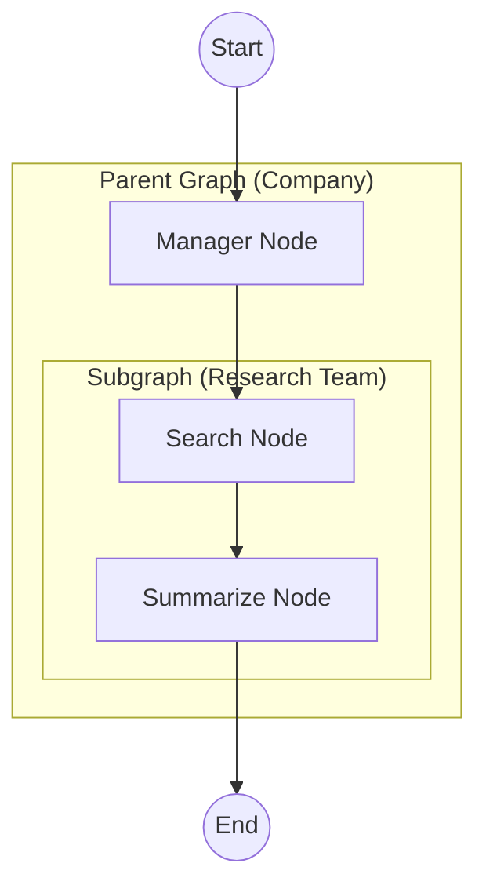
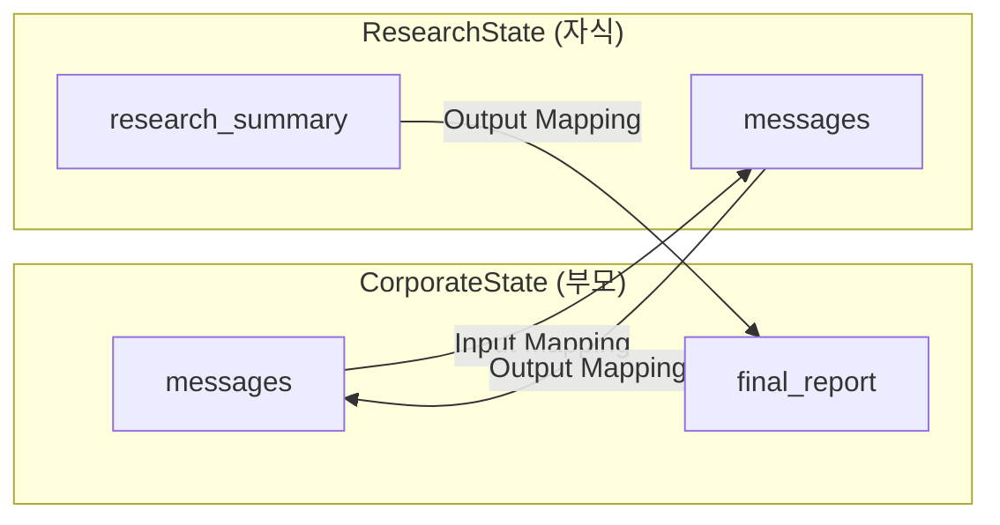

# 계층적 서브그래프 (Hierarchical Subgraphs)

복잡한 시스템을 작은 그래프(서브그래프)로 쪼개어 관리하는 방법입니다.

## LangGraph란?

LangGraph는 LangChain 팀에서 개발한 라이브러리로, **상태 기반의 순환 그래프 구조**를 통해 복잡한 AI 에이전트 시스템을 구축할 수 있게 해줍니다. 서브그래프는 복잡한 시스템을 모듈화하는 핵심 기능입니다.

## 이 예제에서 배우는 것

- **서브그래프 정의**: 독립적으로 동작하는 작은 그래프를 만드는 방법
- **그래프 합성**: 서브그래프를 상위 그래프의 노드로 포함시키는 방법
- **상태 매핑**: 부모-자식 그래프 간 상태 변환
- **모듈화 설계**: 재사용 가능한 컴포넌트로 시스템을 구성하는 방법

## 아키텍처



---

## 📝 코드 상세 분석

### 1. 서브그래프 정의 (Research Team)

```python
from typing import Annotated, TypedDict
from langgraph.graph import StateGraph, START, END
from langgraph.graph.message import add_messages

# 서브그래프 전용 상태
class ResearchState(TypedDict):
    messages: Annotated[list, add_messages]
    research_summary: str  # 서브그래프 고유 필드

def basic_search(state: ResearchState):
    """검색을 시뮬레이션"""
    return {"messages": [AIMessage(content="[SearchBot] Found info about LangGraph.")]}

def summarizer(state: ResearchState):
    """검색 결과를 요약"""
    return {"research_summary": "LangGraph is a library for building stateful, multi-actor applications with LLMs."}

# 서브그래프 빌드
research_builder = StateGraph(ResearchState)
research_builder.add_node("search", basic_search)
research_builder.add_node("summarize", summarizer)

research_builder.add_edge(START, "search")
research_builder.add_edge("search", "summarize")
research_builder.add_edge("summarize", END)

# 서브그래프 컴파일
research_graph = research_builder.compile()
```

**핵심 포인트**:
- 서브그래프는 **자체 State 스키마**를 가질 수 있음
- 독립적으로 컴파일되어 재사용 가능
- `research_summary`는 서브그래프에서만 사용되는 필드

---

### 2. 부모 그래프 정의 (Company)

```python
class CorporateState(TypedDict):
    messages: Annotated[list, add_messages]
    final_report: str

def manager(state: CorporateState):
    return {"messages": [AIMessage(content="[Manager] I will assign this to the research team.")]}
```

**부모와 자식 State의 차이**:
- 부모: `CorporateState` (messages, final_report)
- 자식: `ResearchState` (messages, research_summary)

---

### 3. 서브그래프를 노드로 감싸기 (핵심!)

```python
def call_research_team(state: CorporateState):
    """서브그래프를 호출하는 래퍼 함수"""
    
    # 1. Input Mapping: 부모 → 자식
    subgraph_input = {"messages": state["messages"]}
    
    # 2. Invoke Subgraph
    result = research_graph.invoke(subgraph_input)
    
    # 3. Output Mapping: 자식 → 부모
    return {
        "messages": [AIMessage(content=f"[Manager] Team finished. Summary: {result['research_summary']}")],
        "final_report": result['research_summary']
    }
```

**세 단계**:
1. **Input Mapping**: 부모 상태 → 서브그래프 입력 형식으로 변환
2. **Invoke**: 서브그래프 실행
3. **Output Mapping**: 서브그래프 결과 → 부모 상태 업데이트

---

### 4. 부모 그래프 조립

```python
builder = StateGraph(CorporateState)
builder.add_node("manager", manager)
builder.add_node("research_team", call_research_team)  # 서브그래프를 노드로!

builder.add_edge(START, "manager")
builder.add_edge("manager", "research_team")
builder.add_edge("research_team", END)

graph = builder.compile()
```

---

### 5. 실행

```python
user_input = "Learn about LangGraph."
events = graph.stream(
    {"messages": [HumanMessage(content=user_input)]},
    stream_mode="values"
)

for event in events:
    if "messages" in event:
        last_msg = event["messages"][-1]
        print(f"[{last_msg.type}]: {last_msg.content}")
```

**실행 흐름**:
1. `manager` 노드: "Research team에 할당하겠습니다"
2. `research_team` 노드 (서브그래프 실행):
   - `search` 노드: 정보 검색
   - `summarize` 노드: 요약 생성
3. 최종 결과 반환

---

## 상태 매핑 다이어그램



---

## 서브그래프 사용 패턴

### 패턴 1: 직접 호출 (예제 방식)

```python
def parent_node(state):
    result = subgraph.invoke({"input": state["input"]})
    return {"output": result["output"]}
```

### 패턴 2: 상태가 동일할 때 직접 노드로

```python
# 상태 스키마가 같으면 래퍼 없이 직접 추가 가능
builder.add_node("subgraph_node", subgraph)
```

### 패턴 3: 여러 서브그래프 선택

```python
def router(state):
    if state["type"] == "research":
        return research_graph.invoke(state)
    else:
        return analysis_graph.invoke(state)
```

---

## 활용 사례

1. **대규모 에이전트 시스템**: 복잡한 시스템을 관리 가능한 단위로 분할
2. **팀 기반 구조**: 리서치팀, 분석팀 등 역할별 서브그래프
3. **재사용 가능한 컴포넌트**: 여러 프로젝트에서 공통으로 사용할 수 있는 모듈
4. **테스트 용이성**: 서브그래프를 독립적으로 테스트 가능

## 장점

| 장점 | 설명 |
|------|------|
| **모듈화** | 각 기능을 독립적인 그래프로 분리 |
| **재사용** | 서브그래프를 여러 부모 그래프에서 사용 |
| **유지보수** | 변경 영향 범위를 제한 |
| **테스트** | 서브그래프를 독립적으로 테스트 |

## 빠른 시작

1.  폴더 이동:
    ```bash
    cd 05_hierarchical_subgraphs
    ```
2.  실행:
    ```bash
    # (최초 실행 시) cp ../multi_agent_supervisor/.env .
    python main.py
    ```

## 실행 예시

```
--- User Request: Learn about LangGraph. ---
[human]: Learn about LangGraph.
[ai]: [Manager] I will assign this to the research team.
[ai]: [SearchBot] Found info about LangGraph.
[ai]: [Manager] Team finished. Summary: LangGraph is a library for building stateful, multi-actor applications with LLMs.
```

---

*LangGraph 튜토리얼 프로젝트의 일부입니다.*
