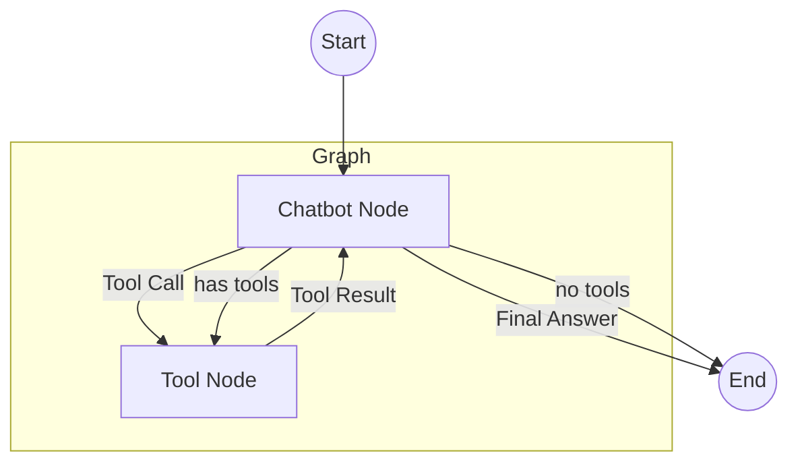

# LangGraph 튜토리얼 및 예제

이 저장소는 다양한 LangGraph 예제와 튜토리얼을 포함하고 있습니다. 각 하위 폴더는 독립적인 프로젝트 또는 패턴을 나타냅니다.

## 프로젝트

### 1. 멀티 에이전트 슈퍼바이저 (Multi-Agent Supervisor) (`/multi_agent_supervisor`)

**슈퍼바이저 에이전트(Supervisor Agent)**가 **연구원(Researcher, 웹 검색)**과 **차트 생성기(Chart Generator, Python 실행)** 사이에서 작업을 라우팅(분배)하는 멀티 에이전트 시스템입니다.

#### 아키텍처 (Architecture)

이 시스템은 **슈퍼바이저 패턴**을 사용합니다. 단일 LLM(슈퍼바이저)이 대화 기록을 바탕으로 다음에 어떤 작업자 노드(Worker Node)를 호출할지 결정합니다.

```mermaid
graph TD
    Start((Start)) --> Supervisor

    subgraph "Supervisor Agent"
        Supervisor[Supervisor Node<br/>(Gemini 2.0 Flash)]
    end

    subgraph "Worker Agents"
        Researcher[Researcher Node<br/>(Tavily Search)]
        ChartGen[Chart Generator Node<br/>(Python REPL)]
    end

    Supervisor -- "Next: Researcher" --> Researcher
    Supervisor -- "Next: ChartGenerator" --> ChartGen
    Supervisor -- "FINISH" --> End((End))

    Researcher --> Supervisor
    ChartGen --> Supervisor
```

#### 빠른 시작 (Quick Start)

**필수 요구사항 (Prerequisites)**

- Python 3.10 이상
- Google Cloud API Key (Gemini 사용을 위해 필요)
- Tavily API Key (웹 검색을 위해 필요)

**설치 및 실행 (Setup & Run)**

1.  프로젝트 폴더로 이동합니다:

    ```bash
    cd multi_agent_supervisor
    ```

2.  의존성 패키지를 설치합니다:

    ```bash
    pip install -r requirements.txt
    ```

3.  환경 변수를 설정합니다:
    `multi_agent_supervisor` 디렉토리(또는 루트)에 `.env` 파일을 생성하고 아래 내용을 입력하세요:

    ```bash
    GOOGLE_API_KEY=your_google_api_key
    TAVILY_API_KEY=your_tavily_api_key
    ```

4.  애플리케이션을 실행합니다:
    ```bash
    python main.py
    ```

**실행 예시 (Example Query)**

> "Research the GDP of South Korea over the last 5 years and plot a line chart."

---

### 2. 단일 에이전트 (Basic Single Agent) (`/single_agent_basic`)

가장 기본적인 형태의 **ReAct(Reason-Act) 에이전트**입니다. 도구(웹 검색)를 사용하여 질문에 답하는 단일 그래프 구조입니다.

#### 아키텍처 (Architecture)

LangGraph의 `create_react_agent`를 사용하여 구성된 순환 그래프입니다. 모델이 도구 호출 여부를 결정하고, 결과를 다시 모델에 공급합니다.

```mermaid
graph TD
    Start((Start)) --> Agent

    subgraph "Single Agent Graph"
        Agent[Agent Node<br/>(LLM + Tool calling)] <--> Tools[Tools Node<br/>(Tavily Search)]
    end

    Agent -- "Answer (End)" --> End((End))
```

#### 빠른 시작 (Quick Start)

**설치 및 실행**

1.  폴더 이동:

    ```bash
    cd single_agent_basic
    ```

2.  의존성 설치:

    ```bash
    pip install -r requirements.txt
    ```

3.  환경 변수 (`.env`) 설정 (필요시 루트의 .env 복사):

    ```bash
    cp ../multi_agent_supervisor/.env .
    ```

4.  실행:
    ```bash
    python main.py
    ```

**실행 예시**

> "Who won the World Series in 2024? If not played yet, who won in 2023?"

---

### 3. 계산기 에이전트 (Calculator Agent) (`/tutorials/01_quickstart_calculator`)

LangGraph의 가장 기초적인 **Quickstart 예제**입니다. `create_react_agent` 같은 고수준 추상화 대신 직접 `StateGraph`, `ToolNode` 등을 정의하여 그래프가 어떻게 동작하는지 이해하는 데 적합합니다.

#### 아키텍처 (Architecture)



#### 빠른 시작 (Quick Start)

1.  폴더 이동:

    ```bash
    cd tutorials/01_quickstart_calculator
    ```

2.  실행 (루트의 `.env`가 필요합니다):
    ```bash
    # (최초 실행 시) cp ../../multi_agent_supervisor/.env .
    python main.py
    ```

**실행 예시**

---

### 4. 스트리밍 패턴 (Streaming Patterns) (`/tutorials/02_streaming_patterns`)

LangGraph의 강력한 기능인 **Streaming API** (`stream_mode="values"`, `stream_mode="updates"`)의 차이점을 보여주는 예제입니다.

#### 실행 모드 비교

- **Values**: 각 단계가 끝난 후의 **전체 상태(State)**를 반환합니다. UI에서 전체 대화 기록을 다시 그릴 때 유용합니다.
- **Updates**: 각 노드가 수행한 **변경된 부분(Delta)**만 반환합니다. 로그를 남기거나 특정 액션을 추적할 때 유용합니다.

#### 빠른 시작

1.  폴더 이동:
    ```bash
    cd tutorials/02_streaming_patterns
    ```
2.  실행:
    ```bash
    # (최초 실행 시) cp ../../multi_agent_supervisor/.env .
    python main.py
    ```

> "Calculate (50 \* 25) + 100"

---

### 5. 데이터 영속성/메모리 (Persistence/Memory) (`/tutorials/03_persistence`)

LangGraph의 **Checkpointer** 기능을 사용하여 대화 상태를 저장하고 불러오는 방법을 다룹니다.

#### 핵심 기능

- **MemorySaver**: (테스트용) 인메모리 저장소. 실제 프로덕션에서는 `SqliteSaver`, `PostgresSaver` 등을 사용합니다.
- **thread_id**: 사용자 세션을 구분하는 고유 ID입니다. 이 ID만 같으면 언제든 이전 대화 내용을 이어서 진행할 수 있습니다.

#### 빠른 시작

1.  폴더 이동:
    ```bash
    cd tutorials/03_persistence
    ```
2.  실행:
    ```bash
    # (최초 실행 시) cp ../../multi_agent_supervisor/.env .
    python main.py
    ```

---

### 6. 휴먼 인 더 루프 (Human-in-the-loop) (`/tutorials/04_human_in_the_loop`)

민감한 작업(예: API 호출, DB 삭제 등) 실행 전에 **사람의 승인**을 받도록 그래프 실행을 일시 중지(`interrupt_before`)하고 재개하는 패턴입니다.

#### 핵심 기능

- **interrupt_before**: 특정 노드 실행 직전에 그래프를 멈춥니다.
- **승인 절차**: 사용자가 승인(y)하면 `graph.stream(None, ...)`으로 멈췄던 지점부터 실행을 재개합니다.

#### 빠른 시작

1.  폴더 이동:
    ```bash
    cd tutorials/04_human_in_the_loop
    ```
2.  실행:
    ```bash
    # (최초 실행 시) cp ../../multi_agent_supervisor/.env .
    python main.py
    ```

**실행 시나리오**

1.  User: "Execute sensitive action..."
2.  Bot: (멈춤) "Waiting for approval..."
3.  User Input: "y"
4.  Bot: "Action Approved. Resuming..." -> 실제 도구 실행.

---

### 7. 계층적 서브그래프 (Hierarchical Subgraphs) (`/tutorials/05_hierarchical_subgraphs`)

복잡한 시스템을 작은 그래프(서브그래프)로 쪼개어 관리하는 방법입니다.

#### 아키텍처 (Conceptual)

- **Parent Graph (Company)**: 전체 흐름을 관리합니다.
- **Subgraph (Research Team)**: 검색 -> 요약 과정을 수행하는 독립적인 그래프입니다.

Parent Graph의 노드 안에서 `search_graph.invoke(state)` 처럼 서브그래프를 호출하여 결과를 받아옵니다. 이는 코드를 모듈화하고 재사용성을 높여줍니다.

#### 빠른 시작

1.  폴더 이동:
    ```bash
    cd tutorials/05_hierarchical_subgraphs
    ```
2.  실행:
    ```bash
    # (최초 실행 시) cp ../../multi_agent_supervisor/.env .
    python main.py
    ```

**실행 시나리오**

1.  Turn 1: "Hi, I'm Bob." -> 봇이 인지함.
2.  Turn 2: "What is my name?" -> 봇이 "Bob"이라고 기억해서 답변함 (이전 메시지 리스트를 수동으로 넣지 않아도 됨).

---

### 8. 계획 및 실행 (Plan-and-Execute) (`/examples/plan_and_execute`)

에이전트가 복잡한 작업을 수행할 때 **먼저 계획(Plan)을 세우고**, 순차적으로 **실행(Execute)**하는 패턴입니다. 실행 결과에 따라 계획을 수정(**Re-plan**)할 수도 있습니다.

#### 아키텍처

- **Planner**: 사용자의 요청을 단계별 작업 목록(List of Steps)으로 변환합니다.
- **Executor**: 현재 단계의 작업을 수행합니다.
- **Replanner**: 작업 완료 여부를 확인하고, 남은 작업을 관리하거나 완료를 선언합니다.

#### 빠른 시작

1.  폴더 이동:
    ```bash
    cd examples/plan_and_execute
    ```
2.  실행:
    ```bash
    # (최초 실행 시) cp ../../multi_agent_supervisor/.env .
    python main.py
    ```

---

### 9. 리플렉션 (Reflection) (`/examples/reflection`)

에이전트가 자신의 출력을 스스로 검토(Critique)하고 개선(Revise)하는 패턴입니다. 품질 향상을 위해 자주 사용됩니다.

#### 아키텍처

- **Generate Node**: 초안을 작성합니다.
- **Reflect Node**: 작성된 초안을 비판적으로 검토합니다.
- **Loop**: 개선할 점이 있다면 다시 Generate Node로 돌아가 수정합니다. (예제에서는 횟수 제한으로 제어합니다)

#### 빠른 시작

1.  폴더 이동:
    ```bash
    cd examples/reflection
    ```
2.  실행:
    ```bash
    # (최초 실행 시) cp ../../multi_agent_supervisor/.env .
    python main.py
    ```

---

### 10. Agentic RAG (`/tutorials/06_agentic_rag`)

단순 검색이 아니라, 검색된 문서의 **연관성을 평가(Grade)**하고, 필요시 재생성하거나 답변을 거부하는 능동적인 RAG 시스템입니다.

#### 아키텍처

- **Retrieve**: Tavily를 통해 문서를 검색합니다.
- **Grade**: LLM이 검색된 문서가 질문과 관련 있는지 평가합니다. (Relevant / Not Relevant)
- **Generate**: 관련 있는 문서만을 사용하여 답변을 생성합니다.

#### 빠른 시작

1.  폴더 이동:
    ```bash
    cd tutorials/06_agentic_rag
    ```
2.  실행:
    ```bash
    # (최초 실행 시) cp ../../multi_agent_supervisor/.env .
    python main.py
    ```

**실행 시나리오**

- User: "Write a poem about bugs."
- Bot (Draft 1): "Bugs are bad..."
- Critic: "Too simple. Make it rhyme."
- Bot (Draft 2): "Code lines red, bugs act dead..."

---

### 11. 멀티 에이전트 네트워크 (Multi-Agent Network) (`/examples/multi_agent_network`)

중앙 통제자(Supervisor) 없이 에이전트들이 **서로 직접 소통(Handoff/Mesh)**하며 협업하는 탈중앙화된 패턴입니다.

#### 아키텍처

- **Researcher**: 정보를 검색합니다. 필요한 경우 `transfer_to_writer` 도구를 호출하여 Writer에게 제어권을 넘깁니다.
- **Writer**: 글을 작성합니다. 추가 정보가 필요하면 `transfer_to_researcher`를 호출하여 다시 Researcher에게 요청합니다.
- **Decentralized**: 모든 에이전트가 주체적으로 판단하여 다음 순서를 정합니다.

#### 빠른 시작

1.  폴더 이동:
    ```bash
    cd examples/multi_agent_network
    ```
2.  실행:
    ```bash
    # (최초 실행 시) cp ../../multi_agent_supervisor/.env .
    python main.py
    ```

---

### 12. LATS (Language Agent Tree Search) (`/examples/lats`)

복잡한 추론 문제를 해결하기 위해 **여러 가지 가능성(Candidates)을 탐색(Expand/Generate)**하고, **평가(Score)**하여 가장 좋은 경로를 선택하는 탐색 기반 패턴입니다.

#### 아키텍처 (Simplified Best-of-N)

- **Expand**: 여러 개의 해결책 후보를 생성합니다.
- **Score**: 각 후보의 정확성을 평가 점수로 매깁니다.
- **Select**: 가장 높은 점수의 후보를 최종 답변으로 선택합니다.

#### 빠른 시작

1.  폴더 이동:
    ```bash
    cd examples/lats
    ```
2.  실행:
    ```bash
    # (최초 실행 시) cp ../../multi_agent_supervisor/.env .
    python main.py
    ```
