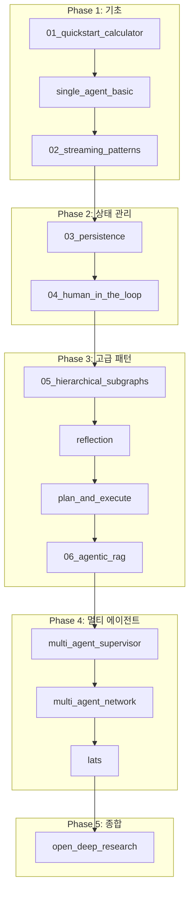

# LangGraph 학습 가이드 📚

이 문서는 LangGraph를 처음 배우는 분들을 위한 **추천 학습 순서**입니다.

## LangGraph란?

**LangGraph**는 LangChain 팀에서 개발한 라이브러리로, **상태 기반의 순환 그래프 구조**를 통해 복잡한 AI 에이전트 시스템을 구축할 수 있게 해줍니다.

### 핵심 개념

| 개념 | 설명 |
|------|------|
| **StateGraph** | 상태(State)를 정의하고 노드 간에 전달하는 그래프 구조 |
| **Node** | 특정 작업을 수행하는 함수 (LLM 호출, 도구 실행 등) |
| **Edge** | 노드 간의 연결, 조건부 분기 가능 |
| **Checkpointer** | 상태를 저장하고 복원하는 영속성 메커니즘 |
| **Stream** | 실시간으로 그래프 실행 과정을 추적 |

---

## 🎯 추천 학습 순서

### Phase 1: 기초 (Foundation)

> **목표**: LangGraph의 기본 구조와 동작 원리 이해

#### 1️⃣ `01_quickstart_calculator` - 그래프 기초
**학습 시간**: 30분

```
📌 배울 것:
- StateGraph 정의 방법
- Node와 Edge 연결
- 조건부 엣지 (Conditional Edge)
- 도구(Tool) 정의 및 사용
```

이 예제에서는 `create_react_agent` 같은 고수준 API를 사용하지 않고, 직접 그래프를 구성합니다. LangGraph가 어떻게 동작하는지 가장 명확하게 이해할 수 있습니다.

---

#### 2️⃣ `single_agent_basic` - ReAct 에이전트
**학습 시간**: 20분

```
📌 배울 것:
- create_react_agent 고수준 API
- 외부 도구 연동 (Tavily 웹 검색)
- 스트리밍 실행
```

고수준 API로 에이전트를 빠르게 만드는 방법을 배웁니다.

---

#### 3️⃣ `02_streaming_patterns` - 스트리밍
**학습 시간**: 20분

```
📌 배울 것:
- stream_mode="values" vs "updates"
- 실시간 UI 업데이트 패턴
- 노드 실행 추적
```

사용자에게 실시간 피드백을 제공하는 방법을 배웁니다.

---

### Phase 2: 상태 관리 (State Management)

> **목표**: 복잡한 상태를 관리하고 대화를 지속하는 방법

#### 4️⃣ `03_persistence` - 영속성
**학습 시간**: 25분

```
📌 배울 것:
- MemorySaver / Checkpointer
- thread_id로 세션 관리
- 대화 맥락 유지
```

---

#### 5️⃣ `04_human_in_the_loop` - 사람 승인
**학습 시간**: 30분

```
📌 배울 것:
- interrupt_before 설정
- 실행 중단 및 재개
- 안전한 도구 실행 패턴
```

위험한 작업 전에 사람의 승인을 받는 패턴을 배웁니다.

---

### Phase 3: 고급 패턴 (Advanced Patterns)

> **목표**: 복잡한 에이전트 아키텍처 설계

#### 6️⃣ `05_hierarchical_subgraphs` - 서브그래프
**학습 시간**: 35분

```
📌 배울 것:
- 그래프 안에 그래프 (서브그래프)
- 상태 매핑
- 모듈화 설계
```

---

#### 7️⃣ `reflection` - 자기 검토
**학습 시간**: 25분

```
📌 배울 것:
- Generate → Reflect 루프
- 품질 향상 패턴
- 반복 횟수 제어
```

---

#### 8️⃣ `plan_and_execute` - 계획-실행
**학습 시간**: 35분

```
📌 배울 것:
- Planner → Executor → Replanner
- 복잡한 작업 분해
- 동적 계획 수정
```

---

#### 9️⃣ `06_agentic_rag` - 능동적 RAG
**학습 시간**: 40분

```
📌 배울 것:
- 문서 평가 (Grading)
- 조건부 생성
- 품질 보장 RAG
```

---

### Phase 4: 멀티 에이전트 (Multi-Agent)

> **목표**: 여러 에이전트가 협업하는 시스템 구축

#### 🔟 `multi_agent_supervisor` - 슈퍼바이저 패턴
**학습 시간**: 45분

```
📌 배울 것:
- 중앙 관제자 (Supervisor)
- 작업자 에이전트 라우팅
- 함수 호출로 구조화된 출력
```

---

#### 1️⃣1️⃣ `multi_agent_network` - 네트워크 패턴
**학습 시간**: 45분

```
📌 배울 것:
- 핸드오프 (Handoff) 도구
- 탈중앙화 협업
- 에이전트 간 메시지 전달
```

---

#### 1️⃣2️⃣ `lats` - 트리 탐색
**학습 시간**: 40분

```
📌 배울 것:
- 후보 생성 (Expansion)
- 점수 평가 및 선택
- Best-of-N 패턴
```

---

### Phase 5: 종합 프로젝트 (Capstone)

#### 1️⃣3️⃣ `open_deep_research` - 심층 리서치
**학습 시간**: 2시간+

여러 패턴을 조합한 실제 프로덕션 수준의 프로젝트입니다.

---

## 📊 학습 로드맵 다이어그램



---

## ⚙️ 환경 설정

### 필수 API 키

```bash
# .env 파일
GOOGLE_API_KEY=your_google_api_key
TAVILY_API_KEY=your_tavily_api_key
```

### 공통 의존성

```bash
pip install langgraph langchain-google-genai langchain-community python-dotenv tavily-python
```

---

## 💡 학습 팁

1. **코드를 직접 실행**하세요 - 읽기만 하지 말고 실행하면서 출력을 확인
2. **그래프 시각화**를 확인하세요 - 각 예제는 `.png` 파일을 생성
3. **입력값을 바꿔보세요** - 다른 질문으로 테스트
4. **디버그 출력 추가** - `print()`로 중간 상태 확인
5. **공식 문서 참조** - [LangGraph Docs](https://langchain-ai.github.io/langgraph/)

---

*Happy Learning! 🚀*
