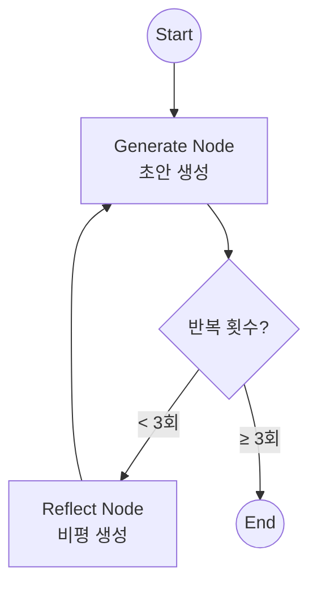
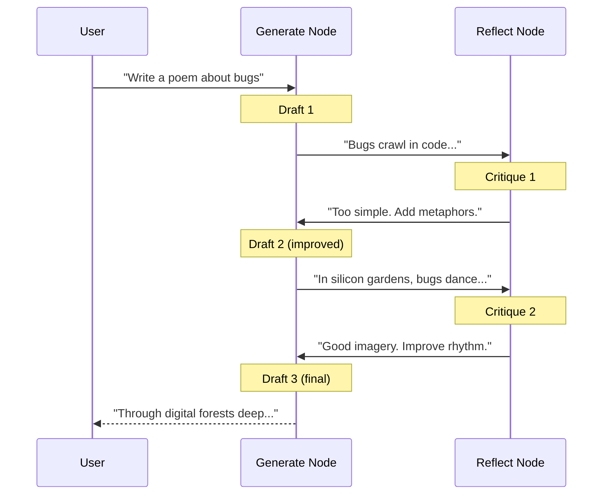

# 리플렉션 (Reflection)

에이전트가 자신의 출력을 스스로 검토(Critique)하고 개선(Revise)하는 패턴입니다. 품질 향상을 위해 자주 사용됩니다.

## LangGraph란?

LangGraph는 LangChain 팀에서 개발한 라이브러리로, **상태 기반의 순환 그래프 구조**를 통해 복잡한 AI 에이전트 시스템을 구축할 수 있게 해줍니다. Reflection은 AI 출력의 품질을 높이는 핵심 패턴입니다.

## 이 예제에서 배우는 것

- **자기 검토 (Self-Critique)**: AI가 자신의 출력을 비판적으로 평가
- **반복 개선 (Iterative Refinement)**: 피드백을 바탕으로 출력을 개선
- **루프 제어**: 반복 횟수를 제한하여 무한 루프 방지
- **품질 제어**: 일정 수준 이상의 품질을 보장하는 메커니즘

## 아키텍처



---

## 📝 코드 상세 분석

### 1. 상태 정의

```python
from typing import Annotated, List
from langgraph.graph.message import add_messages
from langchain_core.messages import BaseMessage

class State(TypedDict):
    messages: Annotated[List[BaseMessage], add_messages]
```

메시지 리스트에 생성물과 비평이 번갈아 쌓임

---

### 2. Generation 노드

```python
llm = ChatGoogleGenerativeAI(model="gemini-2.0-flash", temperature=0)

def generation_node(state: State):
    """초안을 생성하거나 피드백을 반영하여 개선"""
    return {"messages": [llm.invoke(state["messages"])]}
```

**동작**:
- 첫 호출: 사용자 요청에 대한 초안 생성
- 이후 호출: 이전 비평을 반영하여 개선된 버전 생성

---

### 3. Reflection 노드 (핵심!)

```python
def reflection_node(state: State):
    """비평가로서 이전 출력을 평가"""
    last_msg = state["messages"][-1]
    
    # LLM에게 비평가 역할 부여
    reflection_prompt = f"""You are a strict critic. 
    Critique the following text for style and accuracy. 
    Provide constructive feedback to improve it.
    
    Text:
    {last_msg.content}"""
    
    critique = llm.invoke(reflection_prompt)
    
    # 비평을 HumanMessage로 반환 (다음 생성에서 참고하도록)
    return {"messages": [HumanMessage(content=f"[Critique]: {critique.content}")]}
```

**핵심 전략**:
- 비평을 `HumanMessage`로 추가 → 다음 `generation_node`가 이를 피드백으로 인식
- 프롬프트에서 명확한 역할 부여 ("strict critic")

---

### 4. 루프 제어 (종료 조건)

```python
def should_continue(state: State):
    """메시지 수로 반복 횟수 제한"""
    # 3회 반복 후 종료 (Gen + Crit) * 3 = 6 messages + 1 initial
    if len(state["messages"]) > 6:
        return END
    return "reflect"
```

**반복 제한 방법들**:
- 메시지 수 기반 (이 예제)
- 점수 기반 (품질이 충분하면 종료)
- 비평 내용 분석 ("no major issues" 감지)

---

### 5. 그래프 조립

```python
graph_builder = StateGraph(State)

graph_builder.add_node("generate", generation_node)
graph_builder.add_node("reflect", reflection_node)

graph_builder.add_edge(START, "generate")
graph_builder.add_conditional_edges("generate", should_continue, ["reflect", END])
graph_builder.add_edge("reflect", "generate")  # 비평 후 다시 생성으로

graph = graph_builder.compile()
```

---

### 6. 실행

```python
initial_input = "Write a very short poem about coding bugs."
inputs = {"messages": [HumanMessage(content=initial_input)]}

for event in graph.stream(inputs, stream_mode="values"):
    last_msg = event["messages"][-1]
    print(f"\n[{last_msg.type.upper()}]:\n{last_msg.content}")
```

---

## 실행 흐름 예시



---

## 메시지 상태 변화

| 순서 | 타입 | 내용 | 역할 |
|------|------|------|------|
| 1 | Human | "Write a poem..." | 사용자 요청 |
| 2 | AI | "Bugs are bad..." | Draft 1 |
| 3 | Human (Critique) | "Too simple..." | 첫 번째 비평 |
| 4 | AI | "In silicon gardens..." | Draft 2 |
| 5 | Human (Critique) | "Good but improve..." | 두 번째 비평 |
| 6 | AI | "Through forests deep..." | Draft 3 (최종) |

---

## 고급 패턴

### 점수 기반 종료

```python
class QualityScore(BaseModel):
    score: float = Field(description="Quality score 0-10")
    feedback: str

def should_continue(state: State):
    # 마지막 메시지의 품질 점수 평가
    quality = evaluate_quality(state["messages"][-1].content)
    if quality.score >= 8.0:
        return END
    return "reflect"
```

### 다중 비평가

```python
def multi_reflection_node(state: State):
    """여러 관점에서 비평"""
    content = state["messages"][-1].content
    
    style_critique = style_critic.invoke(content)
    accuracy_critique = accuracy_critic.invoke(content)
    
    combined = f"""
    [Style]: {style_critique}
    [Accuracy]: {accuracy_critique}
    """
    return {"messages": [HumanMessage(content=combined)]}
```

---

## 활용 사례

1. **글쓰기 보조**: 에세이, 보고서 등의 품질 향상
2. **코드 생성**: 생성된 코드를 검토하고 개선
3. **창작 활동**: 아이디어를 반복적으로 다듬어 완성도 높이기
4. **번역**: 번역 품질을 반복 개선
5. **요약**: 요약문을 정확도와 간결함 측면에서 개선

## Reflection vs Self-Consistency 비교

| 항목 | Reflection | Self-Consistency |
|------|------------|------------------|
| 방식 | 비평 후 개선 | 여러 답변 생성 후 투표 |
| 반복 | 순차적 개선 | 병렬 생성 |
| 장점 | 점진적 품질 향상 | 빠른 실행 |
| 단점 | 시간이 오래 걸림 | 일관성만 측정 |

## 빠른 시작

1.  폴더 이동:
    ```bash
    cd reflection
    ```
2.  실행:
    ```bash
    # (최초 실행 시) cp ../multi_agent_supervisor/.env .
    python main.py
    ```

## 실행 예시

```
--- User Input: Write a very short poem about coding bugs. ---

[HUMAN]:
Write a very short poem about coding bugs.

[AI]:
Bugs hide in code so neat,
Making programs incomplete.
Debugging starts the fight,
Until the code runs right.

[HUMAN]:
[Critique]: The poem is functional but lacks creativity. 
Consider using metaphors or more vivid imagery...

[AI]:
In silicon gardens, bugs take flight,
Invisible gremlins in the night.
With patience and a debugger's eye,
We watch them fail, we watch them die.

[HUMAN]:
[Critique]: Much better imagery! The rhythm is good...

[AI]:
Through digital forests, shadows creep,
Where bugs in binary slumber sleep.
A developer's torch burns bright,
Illuminating code's dark night.
```

---

*LangGraph 튜토리얼 프로젝트의 일부입니다.*
