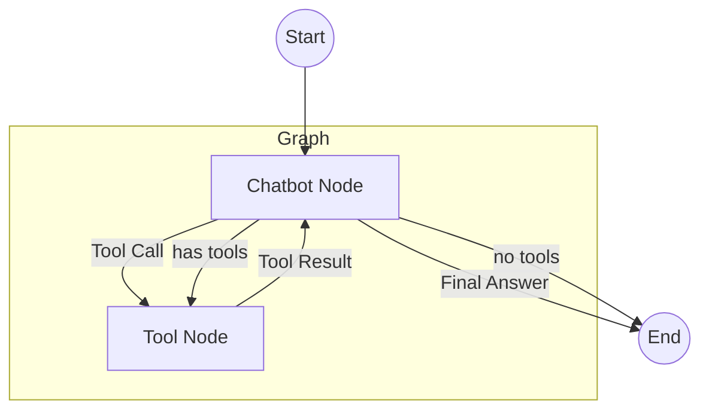

# 계산기 에이전트 (Calculator Agent - Quickstart)

LangGraph의 가장 기초적인 **Quickstart 예제**입니다. `create_react_agent` 같은 고수준 추상화 대신 직접 `StateGraph`, `ToolNode` 등을 정의하여 그래프가 어떻게 동작하는지 이해하는 데 적합합니다.

## LangGraph란?

LangGraph는 LangChain 팀에서 개발한 라이브러리로, **상태 기반의 순환 그래프 구조**를 통해 복잡한 AI 에이전트 시스템을 구축할 수 있게 해줍니다.

## 이 예제에서 배우는 것

- **StateGraph**: LangGraph의 핵심 구성 요소로, 상태를 정의하고 관리하는 방법
- **ToolNode**: 도구 실행을 담당하는 노드를 직접 정의하는 방법
- **조건부 엣지 (Conditional Edge)**: 노드의 출력에 따라 다음 경로를 분기하는 방법
- **그래프 컴파일**: 정의된 그래프를 실행 가능한 형태로 컴파일하는 과정

## 아키텍처 (Architecture)



---

## 📝 코드 상세 분석

### 1. 도구(Tool) 정의

```python
from langchain_core.tools import tool

@tool
def add(a: int, b: int) -> int:
    """Adds a and b."""
    return a + b

@tool
def multiply(a: int, b: int) -> int:
    """Multiplies a and b."""
    return a * b

@tool
def divide(a: int, b: int) -> float:
    """Divides a by b."""
    if b == 0:
        raise ValueError("Cannot divide by zero.")
    return a / b

tools = [add, multiply, divide]
tools_by_name = {t.name: t for t in tools}
```

**설명**: 
- `@tool` 데코레이터로 함수를 LangChain 도구로 변환
- docstring은 LLM이 도구를 이해하는 데 사용됨
- `tools_by_name` 딕셔너리로 이름으로 도구를 빠르게 찾을 수 있음

---

### 2. 상태(State) 정의

```python
from typing import Annotated
from typing_extensions import TypedDict
from langgraph.graph.message import add_messages

class State(TypedDict):
    # 'add_messages' handles appending messages to the list
    messages: Annotated[list, add_messages]
```

**설명**:
- `TypedDict`로 상태의 스키마를 정의
- `Annotated[list, add_messages]`는 메시지가 추가될 때 덮어쓰기가 아닌 **append** 방식으로 동작하게 함
- `add_messages`는 LangGraph에서 제공하는 리듀서 함수

---

### 3. 노드(Node) 정의

```python
llm = ChatGoogleGenerativeAI(model="gemini-2.0-flash", temperature=0)
llm_with_tools = llm.bind_tools(tools)

def chatbot(state: State):
    """LLM을 호출하고 응답을 반환하는 노드"""
    return {"messages": [llm_with_tools.invoke(state["messages"])]}

def tool_node(state: State):
    """도구를 실행하고 결과를 반환하는 노드"""
    outputs = []
    last_message = state["messages"][-1]
    
    for tool_call in last_message.tool_calls:
        try:
            tool_result = tools_by_name[tool_call["name"]].invoke(tool_call)
            outputs.append(
                ToolMessage(
                    content=str(tool_result),
                    name=tool_call["name"],
                    tool_call_id=tool_call["id"],
                )
            )
        except Exception as e:
            outputs.append(
                ToolMessage(
                    content=f"Error: {e}",
                    name=tool_call["name"],
                    tool_call_id=tool_call["id"],
                )
            )
            
    return {"messages": outputs}
```

**핵심 포인트**:
- `llm.bind_tools(tools)`: LLM에 사용 가능한 도구 목록을 바인딩
- `tool_calls`: AI 메시지에 포함된 도구 호출 요청 리스트
- `ToolMessage`: 도구 실행 결과를 담는 메시지 타입

---

### 4. 라우팅(Routing) 함수

```python
from langgraph.graph import END

def should_continue(state: State):
    """다음에 어디로 갈지 결정"""
    last_message = state["messages"][-1]
    # If there are tool calls, go to 'tools', otherwise END
    if last_message.tool_calls:
        return "tools"
    return END
```

**설명**:
- 마지막 메시지에 도구 호출이 있으면 → `"tools"` 노드로
- 없으면 → `END`로 (그래프 종료)

---

### 5. 그래프 조립 및 컴파일

```python
from langgraph.graph import StateGraph, START, END

graph_builder = StateGraph(State)

# 노드 추가
graph_builder.add_node("chatbot", chatbot)
graph_builder.add_node("tools", tool_node)

# 엣지 추가
graph_builder.add_edge(START, "chatbot")
graph_builder.add_conditional_edges("chatbot", should_continue, ["tools", END])
graph_builder.add_edge("tools", "chatbot")  # Loop back to chatbot after tools

# 컴파일
graph = graph_builder.compile()
```

**흐름 설명**:
1. `START` → `chatbot` (항상)
2. `chatbot` → `tools` 또는 `END` (조건부)
3. `tools` → `chatbot` (항상, 루프백)

---

### 6. 실행

```python
user_input = "Calculate (50 * 25) + 100"
events = graph.stream(
    {"messages": [HumanMessage(content=user_input)]},
    stream_mode="values"
)

for event in events:
    last_msg = event["messages"][-1]
    print(f"[{last_msg.type}]: {last_msg.content}")
```

**실행 흐름**:
1. 사용자 메시지 입력
2. `chatbot` 노드가 LLM 호출 → `multiply(50, 25)` 도구 호출 결정
3. `tools` 노드가 도구 실행 → 결과 1250
4. `chatbot` 노드가 다시 호출 → `add(1250, 100)` 도구 호출
5. `tools` 노드가 도구 실행 → 결과 1350
6. `chatbot` 노드가 최종 답변 생성

---

## 활용 사례

1. **학습 목적**: LangGraph의 내부 동작 원리를 이해
2. **맞춤형 에이전트 구축**: 고수준 API로는 불가능한 세밀한 제어가 필요할 때
3. **간단한 도구 사용 에이전트**: 계산기, 날씨 조회 등 단순 도구 연동

## 빠른 시작 (Quick Start)

1.  폴더 이동:

    ```bash
    cd 01_quickstart_calculator
    ```

2.  실행 (루트의 `.env`가 필요합니다):
    ```bash
    # (최초 실행 시) cp ../multi_agent_supervisor/.env .
    python main.py
    ```

## 실행 예시

> "Calculate 25 * 4 + 50"

**예상 출력**:
```
[human]: Calculate 25 * 4 + 50
[ai]: (tool calls: multiply)
[tool]: 100
[ai]: (tool calls: add)
[tool]: 150
[ai]: The result of 25 * 4 + 50 is 150.
```

---

*LangGraph 튜토리얼 프로젝트의 일부입니다.*
