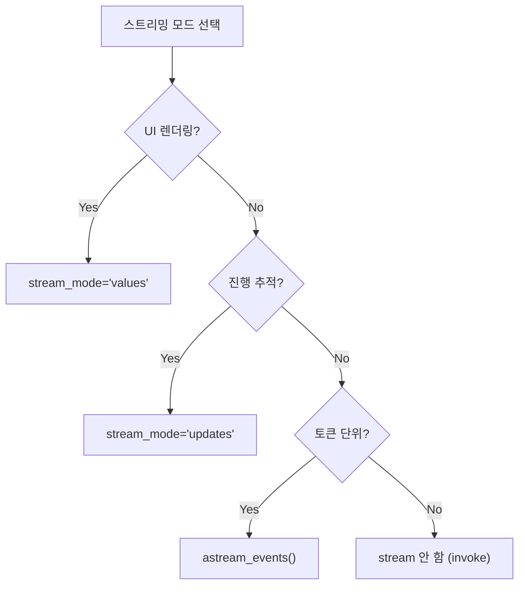

# 스트리밍 패턴 (Streaming Patterns)

LangGraph의 강력한 기능인 **Streaming API** (`stream_mode="values"`, `stream_mode="updates"`)의 차이점을 보여주는 예제입니다.

## LangGraph란?

LangGraph는 LangChain 팀에서 개발한 라이브러리로, **상태 기반의 순환 그래프 구조**를 통해 복잡한 AI 에이전트 시스템을 구축할 수 있게 해줍니다. 스트리밍은 실시간 응답을 위한 핵심 기능입니다.

## 이 예제에서 배우는 것

- **stream_mode의 종류**: values와 updates의 차이점
- **실시간 피드백**: 사용자에게 진행 상황을 실시간으로 보여주는 방법
- **상태 추적**: 그래프 실행 중 상태 변화를 모니터링하는 방법

## 실행 모드 비교

| 모드 | 반환 값 | 사용 시나리오 |
|------|---------|--------------|
| **values** | 각 단계 후의 **전체 상태** | UI에서 전체 대화 기록을 다시 그릴 때 |
| **updates** | 각 노드가 수행한 **변경 사항만** | 로그, 특정 액션 추적 |

---

## 📝 코드 상세 분석

### 1. 상태 및 노드 정의

```python
from typing import Annotated
from typing_extensions import TypedDict
from langgraph.graph.message import add_messages
import time

class State(TypedDict):
    messages: Annotated[list, add_messages]

llm = ChatGoogleGenerativeAI(model="gemini-2.0-flash", temperature=0, stream=True)

def chatbot(state: State):
    """LLM 응답을 생성하는 노드"""
    return {"messages": [llm.invoke(state["messages"])]}

def slow_node(state: State):
    """시간이 걸리는 작업을 시뮬레이션하는 노드"""
    time.sleep(1)  # 1초 대기
    return {"messages": [AIMessage(content="[System] Processed data slowly...")]}
```

**설명**: 
- `slow_node`는 시간이 걸리는 작업을 시뮬레이션
- 스트리밍이 없다면 사용자는 모든 작업이 끝날 때까지 기다려야 함

---

### 2. 그래프 구성

```python
graph_builder = StateGraph(State)
graph_builder.add_node("chatbot", chatbot)
graph_builder.add_node("slow_process", slow_node)

graph_builder.add_edge(START, "chatbot")
graph_builder.add_edge("chatbot", "slow_process")
graph_builder.add_edge("slow_process", END)

graph = graph_builder.compile()
```

**흐름**: `START` → `chatbot` → `slow_process` → `END`

---

### 3. Mode 1: Stream Values

```python
print("=== Mode 1: Stream Values ===")
for event in graph.stream(inputs, stream_mode="values"):
    # Returns the entire state {'messages': [...]}
    last_msg = event["messages"][-1]
    print(f"State Update: Last message from {last_msg.type}: {last_msg.content[:30]}...")
```

**출력 형태**:
```
State Update: Last message from human: Tell me a very short story ab...
State Update: Last message from ai: Once upon a time, in a factory...
State Update: Last message from ai: [System] Processed data slowly...
```

**특징**:
- 각 단계마다 **전체 메시지 리스트**가 반환됨
- UI에서 채팅 화면을 처음부터 다시 렌더링할 때 유용

---

### 4. Mode 2: Stream Updates

```python
print("=== Mode 2: Stream Updates ===")
for event in graph.stream(inputs, stream_mode="updates"):
    # Returns {node_name: node_output}
    for node_name, node_output in event.items():
        print(f"Node '{node_name}' finished. Added {len(node_output['messages'])} message(s).")
```

**출력 형태**:
```
Node 'chatbot' finished. Added 1 message(s).
Node 'slow_process' finished. Added 1 message(s).
```

**특징**:
- 각 노드가 **추가한 변경 사항만** 반환
- 디버깅, 로깅, 진행 상황 추적에 유용

---

### 5. Mode 3: Stream Tokens (고급)

```python
# 토큰 단위 스트리밍은 astream_events API 사용
# 각 LLM 토큰이 생성될 때마다 이벤트 발생
# 실시간 타이핑 효과 구현에 사용
```

> 토큰 스트리밍은 `astream_events` API를 통해 구현합니다. 이 예제에서는 다루지 않습니다.

---

## 스트리밍 모드 선택 가이드



---

## 활용 사례

1. **채팅 UI 구현**: 실시간으로 응답을 표시하는 채팅 인터페이스
2. **진행 상황 표시**: 복잡한 작업의 각 단계를 사용자에게 보여줄 때
3. **디버깅**: 그래프 실행 과정을 상세히 추적할 때

## 실제 사용 예시: 채팅 UI

```python
# React/Vue에서 사용할 때
async for event in graph.astream(inputs, stream_mode="values"):
    # WebSocket으로 클라이언트에 전송
    await websocket.send(json.dumps({
        "messages": serialize_messages(event["messages"])
    }))
```

## 빠른 시작

1.  폴더 이동:
    ```bash
    cd 02_streaming_patterns
    ```
2.  실행:
    ```bash
    # (최초 실행 시) cp ../multi_agent_supervisor/.env .
    python main.py
    ```

## 실행 예시

> "Tell me a very short story about a robot."

**예상 출력**:
```
=== Mode 1: Stream Values ===
State Update: Last message from human: Tell me a very short story...
State Update: Last message from ai: Once upon a time...
State Update: Last message from ai: [System] Processed data slowly...

=== Mode 2: Stream Updates ===
Node 'chatbot' finished. Added 1 message(s).
Node 'slow_process' finished. Added 1 message(s).
```

---

*LangGraph 튜토리얼 프로젝트의 일부입니다.*
