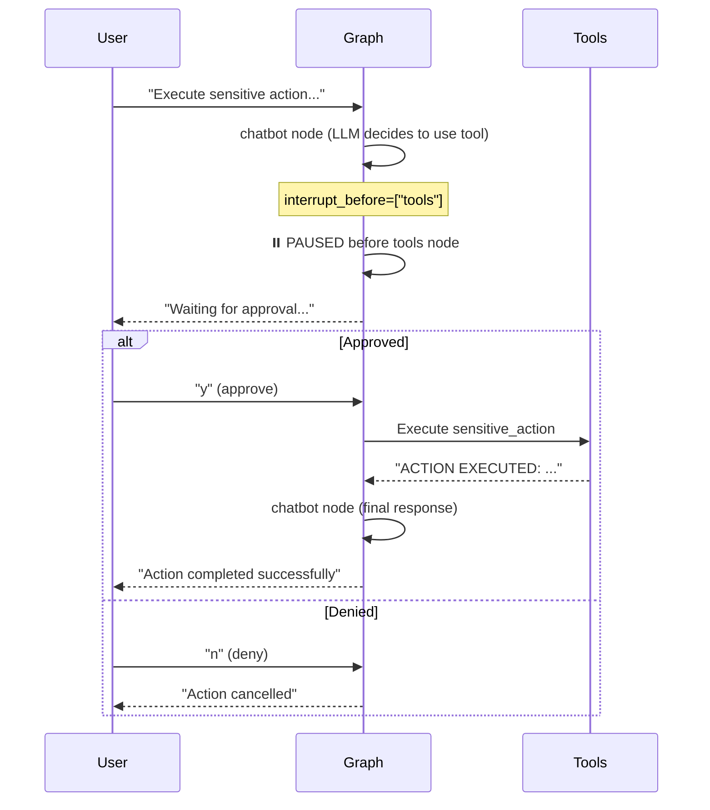

# 휴먼 인 더 루프 (Human-in-the-loop)

민감한 작업(예: API 호출, DB 삭제 등) 실행 전에 **사람의 승인**을 받도록 그래프 실행을 일시 중지(`interrupt_before`)하고 재개하는 패턴입니다.

## LangGraph란?

LangGraph는 LangChain 팀에서 개발한 라이브러리로, **상태 기반의 순환 그래프 구조**를 통해 복잡한 AI 에이전트 시스템을 구축할 수 있게 해줍니다. Human-in-the-loop는 AI의 안전한 운영을 위한 핵심 패턴입니다.

## 이 예제에서 배우는 것

- **interrupt_before**: 특정 노드 실행 직전에 그래프를 멈추는 방법
- **실행 재개**: 사용자 승인 후 중단된 지점부터 실행을 재개하는 방법
- **안전한 도구 실행**: 위험한 작업 전 사람의 확인을 받는 패턴

## 핵심 개념

| 기능 | 설명 |
|------|------|
| **interrupt_before** | 특정 노드 실행 직전에 그래프를 멈춤 |
| **interrupt_after** | 특정 노드 실행 직후에 그래프를 멈춤 |
| **get_state()** | 현재 그래프 상태 및 다음 노드 확인 |
| **stream(None, config)** | 멈춘 지점부터 실행 재개 |

---

## 📝 코드 상세 분석

### 1. 민감한 도구 정의

```python
from langchain_core.tools import tool

@tool
def sensitive_action(data: str) -> str:
    """A tool that requires approval."""
    return f"ACTION EXECUTED: Processed '{data}'"

tools = [sensitive_action]
tools_by_name = {t.name: t for t in tools}
```

**시나리오**: 이 도구는 실행 전 반드시 사람의 승인이 필요

---

### 2. 표준 그래프 구조 정의

```python
class State(TypedDict):
    messages: Annotated[list, add_messages]

llm = ChatGoogleGenerativeAI(model="gemini-2.0-flash", temperature=0)
llm_with_tools = llm.bind_tools(tools)

def chatbot(state: State):
    return {"messages": [llm_with_tools.invoke(state["messages"])]}

def tool_node(state: State):
    outputs = []
    last_message = state["messages"][-1]
    
    for tool_call in last_message.tool_calls:
        tool_result = tools_by_name[tool_call["name"]].invoke(tool_call)
        outputs.append(
            ToolMessage(
                content=str(tool_result),
                name=tool_call["name"],
                tool_call_id=tool_call["id"],
            )
        )
    return {"messages": outputs}

def should_continue(state: State):
    last_message = state["messages"][-1]
    if last_message.tool_calls:
        return "tools"
    return END
```

---

### 3. Human-in-the-loop 설정 (핵심!)

```python
from langgraph.checkpoint.memory import MemorySaver

# !!! HUMAN-IN-THE-LOOP !!!
# We want to interrupt BEFORE the 'tools' node executes
checkpointer = MemorySaver()
graph = graph_builder.compile(
    checkpointer=checkpointer,
    interrupt_before=["tools"]  # ← 이 부분이 핵심!
)
```

**핵심 코드**: `interrupt_before=["tools"]`

**의미**: 
- `tools` 노드가 실행되기 **직전에** 그래프가 멈춤
- 사용자가 승인할 때까지 대기
- `checkpointer`가 필수! (상태를 저장해야 재개 가능)

---

### 4. 실행 및 중단

```python
config = {"configurable": {"thread_id": "thread-2"}}

# 1. User request
user_input = "Please execute the sensitive action with data 'Secret123'."

# We run the graph until it hits the interruption point
for event in graph.stream(
    {"messages": [HumanMessage(content=user_input)]},
    config=config,
    stream_mode="values"
):
    last_msg = event["messages"][-1]
    print(f"[{last_msg.type}] {last_msg.content}")
```

**이 시점에서 일어나는 일**:
1. 사용자 메시지 처리
2. LLM이 `sensitive_action` 도구를 호출하기로 결정
3. ⚠️ `tools` 노드 직전에서 **그래프 멈춤**

---

### 5. 상태 확인 및 승인 대기

```python
# Check status
snapshot = graph.get_state(config)
print(f"\n--- Graph Status: {snapshot.next} ---")
if "tools" in snapshot.next:
    print(">> Graph paused before 'tools'. Waiting for approval...")

# 2. Approve and Continue
approval = input("\nDo you approve this action? (y/n): ")
```

**`snapshot.next`**: 다음에 실행될 노드 이름 리스트

---

### 6. 승인 후 재개

```python
if approval.lower() == "y":
    print(">> Action Approved. Resuming graph...")
    # Passing None as input (or minimal update) resumes execution
    for event in graph.stream(None, config=config, stream_mode="values"):
        last_msg = event["messages"][-1]
        print(f"[{last_msg.type}] {last_msg.content}")
else:
    print(">> Action Denied.")
```

**`stream(None, config)`**: 
- 새 입력 없이 중단된 지점부터 재개
- `config`의 `thread_id`로 어떤 실행을 재개할지 식별

---

## 동작 흐름 다이어그램



---

## 활용 사례

1. **위험한 작업 승인**: DB 삭제, 결제 처리 등 되돌리기 어려운 작업 전 확인
2. **중요 결정 검토**: AI의 판단을 사람이 최종 승인
3. **협업 워크플로우**: AI가 초안을 작성하고 사람이 검토 후 진행
4. **규정 준수**: 특정 작업에 대한 감사 로그 및 승인 기록

## 추가 옵션

### interrupt_after 사용

```python
# 노드 실행 '후'에 멈춤 (결과 검토용)
graph = graph_builder.compile(
    checkpointer=checkpointer,
    interrupt_after=["tools"]
)
```

### 여러 노드에서 중단

```python
graph = graph_builder.compile(
    checkpointer=checkpointer,
    interrupt_before=["tools", "sensitive_node", "payment_node"]
)
```

## 빠른 시작

1.  폴더 이동:
    ```bash
    cd 04_human_in_the_loop
    ```
2.  실행:
    ```bash
    # (최초 실행 시) cp ../multi_agent_supervisor/.env .
    python main.py
    ```

## 실행 예시

```
--- [Step 1] User Request: Please execute the sensitive action... ---
[human] Please execute the sensitive action with data 'Secret123'.
[ai] (tool_calls: sensitive_action)

--- [Step 2] Graph Status: ('tools',) ---
>> Graph paused before 'tools'. Waiting for approval...

Do you approve this action? (y/n): y
>> Action Approved. Resuming graph...
[tool] ACTION EXECUTED: Processed 'Secret123'
[ai] I have successfully executed the sensitive action with your data.
```

---

*LangGraph 튜토리얼 프로젝트의 일부입니다.*
