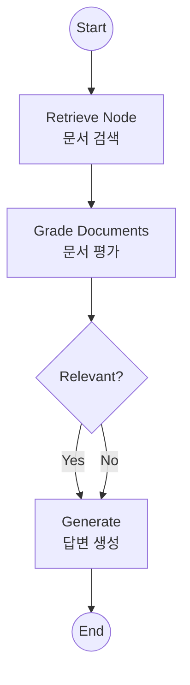
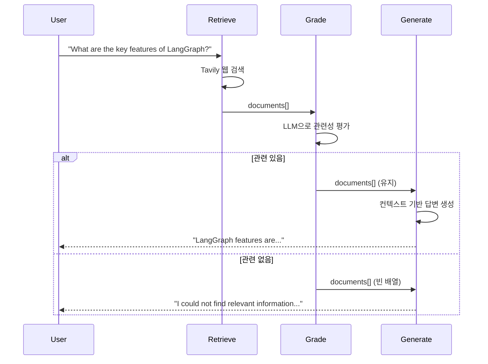

# Agentic RAG

단순 검색이 아니라, 검색된 문서의 **연관성을 평가(Grade)**하고, 필요시 재생성하거나 답변을 거부하는 능동적인 RAG 시스템입니다.

## LangGraph란?

LangGraph는 LangChain 팀에서 개발한 라이브러리로, **상태 기반의 순환 그래프 구조**를 통해 복잡한 AI 에이전트 시스템을 구축할 수 있게 해줍니다. Agentic RAG는 RAG 시스템에 에이전트 기능을 결합한 고급 패턴입니다.

## 이 예제에서 배우는 것

- **문서 평가 (Grading)**: 검색된 문서가 질문과 관련 있는지 LLM이 평가
- **구조화된 출력**: Pydantic 모델로 LLM 출력 형식 강제
- **조건부 흐름**: 평가 결과에 따라 다른 경로로 진행
- **품질 보장**: 관련 없는 문서는 제외하고 관련 있는 문서만 사용

## 아키텍처



---

## 📝 코드 상세 분석

### 1. 기본 설정

```python
from langchain_google_genai import ChatGoogleGenerativeAI
from langchain_community.tools.tavily_search import TavilySearchResults
from pydantic import BaseModel, Field

llm = ChatGoogleGenerativeAI(model="gemini-2.0-flash", temperature=0)
search_tool = TavilySearchResults(k=3)
```

---

### 2. 문서 평가기 (Grader) - 핵심!

```python
class GradeDocuments(BaseModel):
    """Binary score for relevance check on retrieved documents."""
    binary_score: str = Field(
        description="Documents are relevant to the question, 'yes' or 'no'"
    )

# 구조화된 출력 설정
structured_llm_grader = llm.with_structured_output(GradeDocuments)

system_prompt_grader = """You are a grader assessing relevance of a retrieved document to a user question.
If the document contains keyword(s) or semantic meaning related to the question, grade it as relevant.
Give a binary score 'yes' or 'no' score to indicate whether the document is relevant to the question."""
```

**핵심 포인트**:
- `with_structured_output(GradeDocuments)`: LLM이 반드시 `GradeDocuments` 형식으로 응답
- 평가 결과는 `"yes"` 또는 `"no"`

---

### 3. 문서 평가 노드

```python
def grade_documents(state):
    """Determines whether the retrieved documents are relevant to the question."""
    print("---CHECK RELEVANCE---")
    question = state["question"]
    documents = state["documents"]
    
    # 첫 번째 문서만 평가 (데모용, 실제로는 모든 문서 평가)
    score = structured_llm_grader.invoke(
        f"User question: {question}\n\nRetrieved document: {documents[0]['content']}"
    )
    grade = score.binary_score
    
    if grade == "yes":
        print("---DECISION: DOCUMENT RELEVANT---")
        return {"documents": documents}
    else:
        print("---DECISION: DOCUMENT NOT RELEVANT---")
        return {"documents": []}  # 관련 없는 문서 필터링
```

---

### 4. 검색 노드

```python
def retrieve(state):
    """Retrieve documents from web search."""
    print("---RETRIEVE---")
    question = state["question"]
    docs = search_tool.invoke(question)
    # Tavily returns list of dicts with 'content' key
    return {"documents": docs}
```

---

### 5. 생성 노드

```python
def generate(state):
    """Generates answer using the retrieved documents."""
    print("---GENERATE---")
    question = state["question"]
    documents = state["documents"]
    
    if not documents:
        return {"generation": "I could not find relevant information to answer your question."}

    # 문서 내용을 컨텍스트로 결합
    context = "\n\n".join([doc['content'] for doc in documents])
    
    prompt = f"""You are an assistant for question-answering tasks. 
    Use the following pieces of retrieved context to answer the question. 
    If you don't know the answer, just say that you don't know. 
    Use three sentences maximum and keep the answer concise.
    
    Question: {question} 
    Context: {context} 
    Answer:"""
    
    generation = llm.invoke(prompt)
    return {"generation": generation.content}
```

---

### 6. 상태 정의

```python
from typing import List, TypedDict

class GraphState(TypedDict):
    question: str       # 사용자 질문
    generation: str     # 생성된 답변
    documents: List[dict]  # 검색된 문서들
```

---

### 7. 그래프 조립

```python
workflow = StateGraph(GraphState)

workflow.add_node("retrieve", retrieve)
workflow.add_node("grade_documents", grade_documents)
workflow.add_node("generate", generate)

workflow.add_edge(START, "retrieve")
workflow.add_edge("retrieve", "grade_documents")

def decide_to_generate(state):
    """Determines whether to generate an answer."""
    if not state["documents"]:
        return "generate"  # 문서 없어도 generate로 (I don't know 응답)
    return "generate"

workflow.add_conditional_edges(
    "grade_documents",
    decide_to_generate,
    {"generate": "generate"}
)
workflow.add_edge("generate", END)

app = workflow.compile()
```

---

## 동작 흐름



---

## 고급 Agentic RAG 패턴

### 질문 재작성 추가

```python
def rewrite_query(state):
    """관련 문서가 없을 때 질문을 재작성"""
    question = state["question"]
    new_question = llm.invoke(f"Rewrite this question for better search: {question}")
    return {"question": new_question.content}

# 조건부 엣지에 추가
workflow.add_conditional_edges(
    "grade_documents",
    decide_to_generate,
    {
        "generate": "generate",
        "rewrite": "rewrite_query"  # 관련 없으면 재작성
    }
)
```

### 답변 품질 평가 추가

```python
def check_hallucination(state):
    """답변이 문서에 근거하는지 확인"""
    # 환각 검사 로직
    pass
```

---

## 활용 사례

1. **고품질 QA 시스템**: 검색 결과의 품질을 보장하는 질의응답
2. **정확한 정보 제공**: 관련 없는 정보를 필터링하여 정확도 향상
3. **엔터프라이즈 검색**: 기업 문서에서 신뢰할 수 있는 답변 제공
4. **연구 보조**: 논문이나 문서에서 관련 정보만 추출

## 일반 RAG vs Agentic RAG

| 항목 | 일반 RAG | Agentic RAG |
|------|----------|-------------|
| 문서 평가 | ❌ 없음 | ✅ LLM이 관련성 평가 |
| 질문 재작성 | ❌ 없음 | ✅ 필요시 자동 재작성 |
| 품질 보장 | ❌ 모든 검색 결과 사용 | ✅ 관련 문서만 사용 |
| 복잡도 | 낮음 | 높음 |

## 빠른 시작

1.  폴더 이동:
    ```bash
    cd 06_agentic_rag
    ```
2.  실행:
    ```bash
    # (최초 실행 시) cp ../multi_agent_supervisor/.env .
    python main.py
    ```

## 실행 예시

```
Initializing Agentic RAG...
---RETRIEVE---
---CHECK RELEVANCE---
---DECISION: DOCUMENT RELEVANT---
---GENERATE---

--- Final Result ---
LangGraph is a library for building stateful, multi-actor applications with LLMs. 
It provides tools for creating complex agent workflows with cycles and branching.
```

---

*LangGraph 튜토리얼 프로젝트의 일부입니다.*
