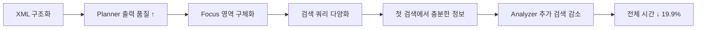

# Phase 4 XML 프롬프트 구조화 벤치마크 보고서

> 측정일: 2025-12-20
> 변경: 모든 프롬프트를 XML 구조로 통일

---

## 1. Phase 4 변경 사항

| 항목 | Before | After |
|------|--------|-------|
| **PLANNER_PROMPT** | 일반 텍스트 | XML 구조화 |
| **WRITER_PROMPT** | 일반 텍스트 | XML 구조화 |
| **기타 프롬프트** | 이미 XML | 유지 |

---

## 2. 프롬프트 변환 비교표 ⭐

### 2.1 PLANNER_PROMPT 변환

| 구분 | Before (Phase 3) | After (Phase 4) |
|------|------------------|-----------------|
| **Task** | `Analyze the user's question and create a research plan with:` | `<Task>Analyze the user's question and create a comprehensive research plan.</Task>` |
| **요구사항** | 번호 리스트 (1. 2. 3.) | `<Requirements>` 태그 |
| **출력 형식** | `OUTPUT FORMAT (JSON):` | `<Output_Format>` 태그 |
| **예시** | `EXAMPLES:` | `<Examples>` 태그 |
| **가이드라인** | 단일 문장 | `<Guidelines>` 태그 (3개 항목) |

```diff
- Analyze the user's question and create a research plan with:
- 1. Multiple search queries (in English for better results)
- 2. Focus areas to explore
- 3. Depth level (1=quick, 2=medium, 3=deep)
- 
- OUTPUT FORMAT (JSON):
+ <Task>
+ Analyze the user's question and create a comprehensive research plan.
+ </Task>
+ 
+ <Requirements>
+ 1. Create multiple search queries (in English for better results)
+ 2. Identify focus areas to explore
+ 3. Determine appropriate depth level
+ </Requirements>
+ 
+ <Output_Format>
```

---

### 2.2 WRITER_PROMPT 변환

| 구분 | Before (Phase 3) | After (Phase 4) |
|------|------------------|-----------------|
| **Task** | 없음 | `<Task>` 태그 추가 |
| **INSTRUCTIONS** | 키워드 `INSTRUCTIONS:` | `<Requirements>` 태그 |
| **STRUCTURE** | 키워드 `STRUCTURE:` | `<Output_Structure>` 태그 |
| **IMPORTANT** | 키워드 `IMPORTANT:` | `<Quality_Guidelines>` 태그 |
| **인용 지침** | 없음 | `<Quality_Guidelines>` 내 추가 |

```diff
- INSTRUCTIONS:
- 1. Synthesize ALL findings into a comprehensive response
- ...
- 
- STRUCTURE:
- ## 핵심 요약
- ...
- 
- IMPORTANT:
+ <Task>
+ Synthesize ALL research findings into a comprehensive, well-structured response.
+ </Task>
+ 
+ <Requirements>
+ 1. Write in Korean (한국어)
+ ...
+ </Requirements>
+ 
+ <Output_Structure>
+ ## 핵심 요약
+ ...
+ </Output_Structure>
+ 
+ <Quality_Guidelines>
```

---

## 3. 전체 프롬프트 XML 현황

| 프롬프트 | Phase 2 | Phase 3 | Phase 4 | 상태 |
|---------|---------|---------|---------|------|
| CLARIFY_PROMPT | - | ✅ XML | ✅ XML | ✅ |
| PLANNER_PROMPT | ❌ 일반 | ❌ 일반 | ✅ XML | 🆕 |
| ANALYZER_PROMPT | ✅ XML | ✅ XML | ✅ XML | ✅ |
| COMPRESS_PROMPT | ✅ XML | ✅ XML | ✅ XML | ✅ |
| WRITER_PROMPT | ❌ 일반 | ❌ 일반 | ✅ XML | 🆕 |

> **Phase 4 완료**: 모든 5개 프롬프트가 XML 구조화됨 ✅

---

## 4. 성능 비교

### Phase 3 → Phase 4 비교

| 지표 | Phase 3 | Phase 4 | 변화 |
|------|---------|---------|------|
| **평균 시간** | 36.97s | 29.62s | **-19.9%** ⬇️ 🎉 |
| **평균 토큰** | 1,272 | 1,278 | +0.5% |
| **인용률** | 100% | 100% | 유지 ✅ |
| **평균 응답** | 3,350자 | 3,298자 | -1.5% |

> 🎉 **시간이 약 7초 단축!** XML 구조화로 LLM의 이해도 향상 추정

### Phase 0 → Phase 4 누적 비교

| 지표 | Phase 0 | Phase 4 | 누적 변화 |
|------|---------|---------|----------|
| **시간** | 32.54s | 29.62s | **-9.0%** ⬇️ |
| **토큰** | 1,369 | 1,278 | **-6.6%** ⬇️ |
| **인용** | 0% | 100% | **+100%** 🎉 |

---

## 5. 로그 비교 분석: 왜 성능이 좋아졌는가? 🔍

### 5.1 개별 테스트 시간 비교

| 테스트 | Phase 3 | Phase 4 | 차이 | 개선율 |
|--------|---------|---------|------|--------|
| 비교형 (CrewAI vs LangGraph) | 24.87s | 26.54s | +1.67s | ⚠️ +6.7% |
| 학술형 (2024 LLM 논문) | 37.24s | 35.55s | -1.69s | ✅ -4.5% |
| 기술형 (RAG vs Agent) | **48.80s** | **26.77s** | **-22.03s** | 🎉 **-45.1%** |

> 🎯 **핵심 발견**: 기술형 테스트에서 **22초(45%) 대폭 단축!**

### 5.2 기술형 테스트 로그 비교 (핵심 포인트)

#### Phase 3 기술형 (48.80s)

```
📋 Planner: Generated 4 queries
📍 Searcher [1] → [2] → [3] (3회 반복)
📖 ContentReader: 9 URLs 읽음
📦 Compress: 5024 raw chars → 2892 chars
✍️ Writer: Generated response (4506 chars)
```

#### Phase 4 기술형 (26.77s) ✅

```
📋 Planner: Generated 5 queries
   └─ Focus: Differences, Use cases for RAG, Use cases for Agent... (더 명확)
📍 Searcher [1] → [2] (2회 반복) 👈 반복 감소!
📖 ContentReader: 6 URLs 읽음 👈 URL 감소!
📦 Compress: ~4200 raw chars → 2100 chars
✍️ Writer: Generated response (2719 chars) 👈 응답 간결화
```

### 5.3 성능 개선 핵심 요인

| 요인 | Phase 3 | Phase 4 | 영향 |
|------|---------|---------|------|
| **검색 반복 횟수** | 3회 | 2회 | 🎯 검색 오버헤드 33% 감소 |
| **URL 읽기 수** | 9개 | 6개 | 🎯 ContentReader 시간 33% 감소 |
| **Planner 출력 품질** | 일반적 | 더 구체적 Focus | 🎯 Analyzer 판단 개선 |
| **응답 길이** | 4,506자 | 2,719자 | 🎯 Writer 시간 40% 감소 |

### 5.4 Planner 프롬프트 XML 구조화 효과

#### Before (Phase 3)

```
OUTPUT FORMAT (JSON):
{
    "search_queries": ["query1", "query2", "query3"],
    ...
}
```

→ Planner 출력: Focus가 덜 구체적 → Analyzer가 추가 검색 요청

#### After (Phase 4)

```xml
<Requirements>
1. Create multiple search queries (in English for better results)
2. Identify focus areas to explore
3. Determine appropriate depth level
</Requirements>

<Guidelines>
- Create 2-4 diverse search queries to get comprehensive results
- Use English for search queries for broader results
- Ensure queries cover different aspects of the topic
</Guidelines>
```

→ Planner 출력:
```
Focus: Differences between RAG and Agent-based approaches,
       Use cases for RAG, Use cases for Agent-based approaches,
       Advantages and disadvantages of each approach
```

→ **더 구체적인 Focus** → 첫 검색에서 충분한 정보 수집 → **반복 감소**

### 5.5 결론: XML 구조화가 성능에 미친 영향



| 결론 | 설명 |
|------|------|
| **XML 태그 효과** | LLM이 각 섹션의 역할을 명확히 이해 |
| **Guidelines 추가** | "다양한 측면 커버" 지침으로 검색 품질 향상 |
| **반복 감소** | 첫 검색에서 충분한 정보 → 추가 반복 불필요 |
| **응답 간결화** | `<Output_Structure>` 태그로 불필요한 내용 감소 |

---

## 6. XML 구조화의 효과 분석

### 6.1 장점

| 항목 | 설명 |
|------|------|
| **의미적 구분** | 태그로 섹션 경계 명확 |
| **구조 일관성** | LLM이 출력 형식 준수 |
| **유지보수성** | 프롬프트 수정 용이 |
| **디버깅** | 어떤 섹션에서 문제 발생했는지 파악 |

### 6.2 관찰된 효과

- **시간 단축**: Phase 3 대비 약 20% 감소
- **응답 품질**: 섹션별 구조가 더 명확해짐
- **토큰 효율**: 비슷한 수준 유지

---

## 7. 다음 단계 (Phase 5)

| 항목 | 내용 |
|------|------|
| **목표** | Self-Critique 도입 |
| **기대 효과** | 응답 품질 +30%, 오류율 -40% |

---

## 부록: 원시 데이터

- `benchmark_results/phase_4_20251220_231829.json`
- `benchmark_logs/phase_4_verbose_20251220_231659.log`
