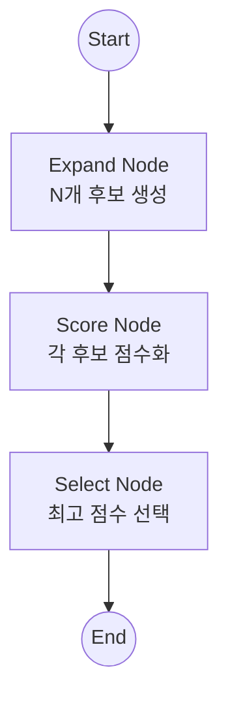
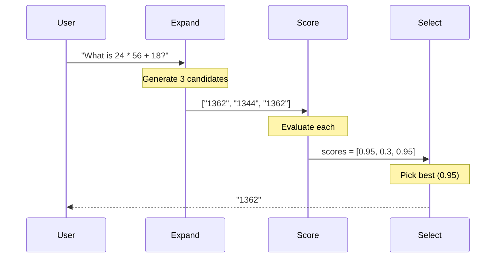
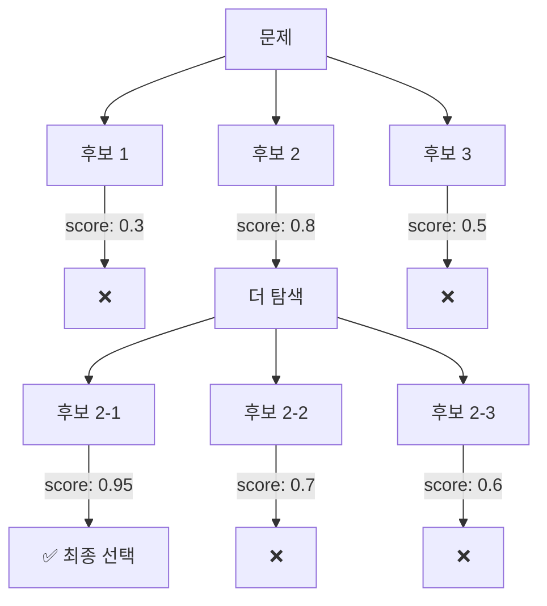

# LATS (Language Agent Tree Search)

복잡한 추론 문제를 해결하기 위해 **여러 가지 가능성(Candidates)을 탐색(Expand/Generate)**하고, **평가(Score)**하여 가장 좋은 경로를 선택하는 탐색 기반 패턴입니다.

## LangGraph란?

LangGraph는 LangChain 팀에서 개발한 라이브러리로, **상태 기반의 순환 그래프 구조**를 통해 복잡한 AI 에이전트 시스템을 구축할 수 있게 해줍니다. LATS는 복잡한 추론을 위한 고급 탐색 패턴입니다.

## 이 예제에서 배우는 것

- **후보 생성 (Expansion)**: 여러 가지 해결책 후보를 병렬로 생성
- **평가 및 선택**: 각 후보를 점수화하고 최적의 답변 선택
- **Best-of-N 패턴**: 여러 답변 중 가장 좋은 것을 선택하는 전략
- **트리 탐색 개념**: 복잡한 문제 공간을 체계적으로 탐색

## 아키텍처



---

## 📝 코드 상세 분석

### 1. 상태 정의

```python
from pydantic import BaseModel

class LatsState(BaseModel):
    # 원본 문제
    input: str
    # 찾은 최종 답변
    final_answer: str = None
    # 현재 후보들
    candidates: List[str] = []
    # 각 후보의 점수
    scores: List[float] = []
    # 탐색 깊이
    height: int = 0
```

**Pydantic 모델 사용**: 복잡한 상태를 더 명확하게 정의

---

### 2. 설정 - 다양성을 위한 높은 Temperature

```python
# LATS benefits from higher temperature for diversity in expansion
llm = ChatGoogleGenerativeAI(model="gemini-2.0-flash", temperature=1.0)
```

**temperature=1.0**: 다양한 후보를 생성하기 위해 높은 값 사용

---

### 3. Expand 노드 (후보 생성)

```python
def expand_node(state: LatsState):
    """Generates N candidate steps/solutions."""
    print(f"---EXPAND (Height: {state.height})---")
    
    n = 3  # 3개 후보 생성
    candidates = []
    for i in range(n):
        res = llm.invoke(
            f"Solve this problem: {state.input}. "
            f"Provide a short candidate solution attempt. "
            f"Current attempt number {i}"
        )
        candidates.append(res.content)
    
    return {"candidates": candidates}
```

**핵심**: 같은 문제에 대해 N개의 다른 해결책을 생성

---

### 4. Score 노드 (평가)

```python
def score_node(state: LatsState):
    """Scores the generated candidates."""
    print("---SCORE---")
    candidates = state.candidates
    scores = []
    
    for cand in candidates:
        prompt = f"""Rate the correctness of the following solution to the problem: '{state.input}'.
        Solution: {cand}
        Provide ONLY a float number between 0.0 and 1.0."""
        
        res = llm.invoke(prompt)
        try:
            score = float(res.content.strip())
        except:
            score = 0.5  # 파싱 실패시 기본값
        scores.append(score)
        
    return {"scores": scores}
```

**평가 전략**: LLM에게 정확도를 0~1 사이 점수로 평가하도록 요청

---

### 5. Select 노드 (선택)

```python
def select_node(state: LatsState):
    """Selects the best candidate."""
    print("---SELECT---")
    
    # 최고 점수 후보 찾기
    best_idx = state.scores.index(max(state.scores))
    best_score = state.scores[best_idx]
    best_candidate = state.candidates[best_idx]
    
    print(f"Best Score: {best_score}")
    
    # 점수가 충분히 높으면 (> 0.9) 수락
    if best_score > 0.9:
        return {"final_answer": best_candidate}
    
    # 그렇지 않으면 최선의 후보를 반환
    # 실제 LATS라면 여기서 Backtrack
    return {"final_answer": best_candidate}
```

---

### 6. 그래프 조립

```python
workflow = StateGraph(LatsState)

workflow.add_node("expand", expand_node)
workflow.add_node("score", score_node)
workflow.add_node("select", select_node)

workflow.add_edge(START, "expand")
workflow.add_edge("expand", "score")
workflow.add_edge("score", "select")
workflow.add_edge("select", END)

app = workflow.compile()
```

---

### 7. 실행

```python
def main():
    # 수학 문제 - 검증 가능
    inputs = {"input": "What is 24 * 56 + 18?"}
    
    result = app.invoke(inputs)
    print("\n--- Final Best Solution ---")
    print(result["final_answer"])
```

---

## 실행 흐름 예시



---

## Best-of-N vs Full LATS

| 항목 | Best-of-N (이 예제) | Full LATS |
|------|-------------------|-----------|
| 구조 | 단일 레벨 | 트리 구조 |
| Backtrack | ❌ 없음 | ✅ 있음 |
| 복잡도 | O(N) | O(N^depth) |
| 사용 사례 | 단순 문제 | 복잡한 추론 |

---

## 고급 패턴: Full LATS

```python
def should_terminate(state: LatsState):
    # 좋은 답변을 찾았거나 최대 깊이 도달
    if state.final_answer and max(state.scores) > 0.9:
        return END
    if state.height > 2:  # Max depth 3
        return END
    return "expand"  # 더 탐색

# 재귀적 탐색을 위한 조건부 엣지
workflow.add_conditional_edges("select", should_terminate, ["expand", END])
```

---

## Tree Search 개념도



---

## LATS vs 다른 추론 패턴

| 패턴 | 접근 방식 | 장점 | 단점 |
|------|----------|------|------|
| **Chain-of-Thought** | 단일 추론 경로 | 단순, 빠름 | 오류에 취약 |
| **Self-Consistency** | 여러 경로, 다수결 | 안정적 | 일관성만 측정 |
| **Tree-of-Thought** | 트리 탐색, 평가 | 정확도 높음 | 느림 |
| **LATS** | ToT + 백트래킹 + 학습 | 가장 정확 | 가장 복잡 |

---

## 활용 사례

1. **수학 문제 풀이**: 여러 접근법을 시도하고 가장 정확한 답 선택
2. **코드 생성**: 여러 구현안을 생성하고 최적의 코드 선택
3. **복잡한 추론**: 단계별 추론이 필요한 문제 해결
4. **게임 AI**: 가능한 수를 탐색하고 최선의 수 선택
5. **의사결정**: 여러 옵션을 평가하고 최선의 선택

## 빠른 시작

1.  폴더 이동:
    ```bash
    cd lats
    ```
2.  실행:
    ```bash
    # (최초 실행 시) cp ../multi_agent_supervisor/.env .
    python main.py
    ```

## 실행 예시

```
Initializing LATS (Best-of-N via Tree Search components)...

---EXPAND (Height: 0)---
---SCORE---
---SELECT---
Best Score: 0.95

--- Final Best Solution ---
24 * 56 = 1344
1344 + 18 = 1362
The answer is 1362.
```

---

*LangGraph 튜토리얼 프로젝트의 일부입니다.*
