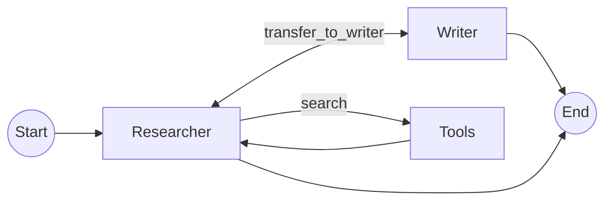
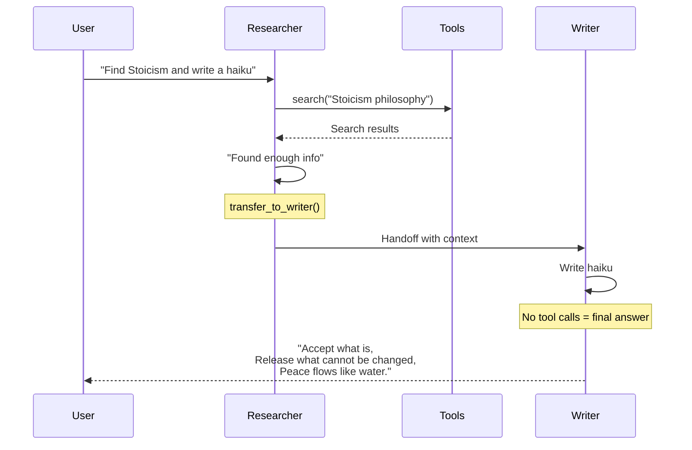
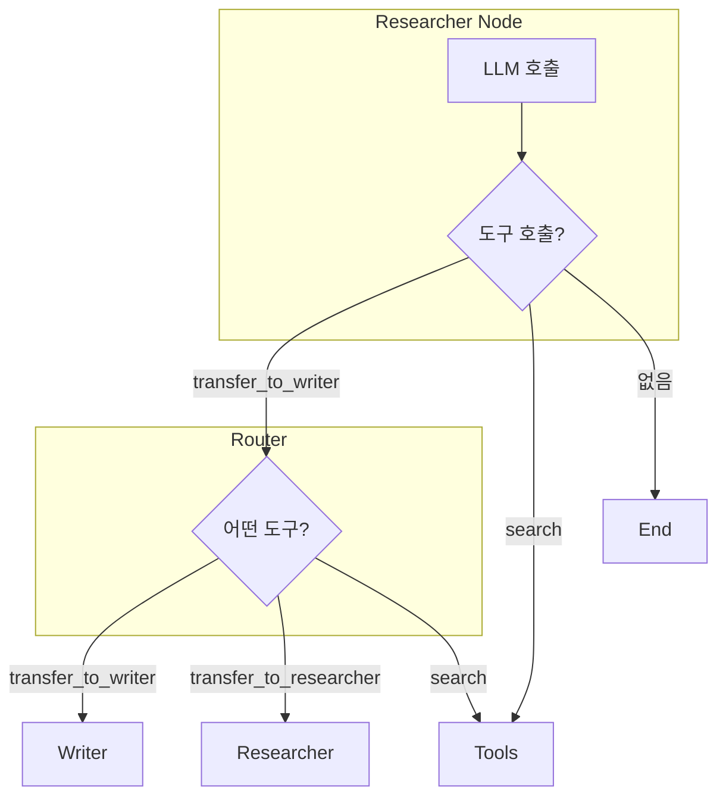

# 멀티 에이전트 네트워크 (Multi-Agent Network)

중앙 통제자(Supervisor) 없이 에이전트들이 **서로 직접 소통(Handoff/Mesh)**하며 협업하는 탈중앙화된 패턴입니다.

## LangGraph란?

LangGraph는 LangChain 팀에서 개발한 라이브러리로, **상태 기반의 순환 그래프 구조**를 통해 복잡한 AI 에이전트 시스템을 구축할 수 있게 해줍니다. Network 패턴은 에이전트 간 유연한 협업을 가능하게 합니다.

## 이 예제에서 배우는 것

- **핸드오프 (Handoff)**: 에이전트가 다른 에이전트에게 제어권을 직접 전달
- **탈중앙화 구조**: 중앙 관제자 없이 에이전트들이 자율적으로 협업
- **유연한 워크플로우**: 상황에 따라 다양한 협업 패턴 가능
- **도구 기반 라우팅**: 전환 도구(transfer tools)를 통한 에이전트 전환

## 아키텍처



---

## 📝 코드 상세 분석

### 1. 핸드오프 도구 정의 (핵심!)

```python
def transfer_to_writer():
    """Transfer control to the Writer agent."""
    return "Transferred to Writer"

def transfer_to_researcher():
    """Transfer control to the Researcher agent."""
    return "Transferred to Researcher"
```

**핵심 아이디어**:
- 실제 작업을 수행하지 않음
- 그래프 라우터가 이 도구 호출을 감지하여 에이전트 전환

---

### 2. 에이전트별 도구 및 프롬프트

```python
from langchain_community.tools.tavily_search import TavilySearchResults

# Researcher 에이전트: 검색 + 작가에게 전달
search_tool = TavilySearchResults(k=2)
researcher_tools = [search_tool, transfer_to_writer]

# Writer 에이전트: 연구원에게 전달만 (작성은 LLM이 직접)
writer_tools = [transfer_to_researcher]

# 도구 바인딩
researcher_model = llm.bind_tools(researcher_tools)
writer_model = llm.bind_tools(writer_tools)
```

---

### 3. 에이전트 프롬프트

```python
detailed_researcher_prompt = """You are a Researcher. 
1. Search for information requested by the user. 
2. If you have found enough info, transfer to the Writer to draft the response.
3. If you need the Writer to explain something or format it, transfer to them."""

detailed_writer_prompt = """You are a Writer. 
1. Write a high-quality response based on the research provided.
2. If you need more information, transfer back to the Researcher.
3. If you are done, just output the final answer."""
```

**에이전트가 스스로 결정**:
- Researcher: "정보가 충분하면 Writer에게 전달"
- Writer: "추가 정보 필요하면 Researcher에게 요청"

---

### 4. 상태 정의

```python
from typing import Annotated, List

class AgentState(TypedDict):
    messages: Annotated[List[BaseMessage], add_messages]
    sender: str  # 현재 활성 에이전트 추적
```

---

### 5. 에이전트 노드

```python
def researcher(state: AgentState):
    print("---Researcher---")
    res = researcher_model.invoke(
        [SystemMessage(content=detailed_researcher_prompt)] + state["messages"]
    )
    return {"messages": [res], "sender": "researcher"}

def writer(state: AgentState):
    print("---Writer---")
    res = writer_model.invoke(
        [SystemMessage(content=detailed_writer_prompt)] + state["messages"]
    )
    return {"messages": [res], "sender": "writer"}
```

---

### 6. 라우터 (핵심!)

```python
def router(state: AgentState) -> Literal["call_tool", "enter_writer", "enter_researcher", "__end__"]:
    """조건부 엣지 함수 - 도구 호출을 분석하여 다음 노드 결정"""
    messages = state["messages"]
    last_message = messages[-1]
    
    if hasattr(last_message, "tool_calls") and len(last_message.tool_calls) > 0:
        tool_name = last_message.tool_calls[0]["name"]
        
        # 핸드오프 도구 감지
        if tool_name == "transfer_to_writer":
            return "enter_writer"
        elif tool_name == "transfer_to_researcher":
            return "enter_researcher"
        else:
            return "call_tool"  # 일반 도구 (검색 등)
            
    return "__end__"  # 도구 호출 없음 = 최종 답변
```

**라우팅 로직**:
1. 도구 호출이 있는가?
2. 핸드오프 도구인가? → 해당 에이전트로 전환
3. 일반 도구인가? → 도구 실행
4. 도구 호출 없음? → 종료 (최종 답변)

---

### 7. 그래프 조립

```python
from langgraph.prebuilt import ToolNode

workflow = StateGraph(AgentState)

workflow.add_node("researcher", researcher)
workflow.add_node("writer", writer)
workflow.add_node("tools", ToolNode([search_tool]))  # 검색 도구만

# 시작점
workflow.add_edge(START, "researcher")

# Researcher 출력 라우팅
workflow.add_conditional_edges(
    "researcher",
    router,
    {
        "enter_writer": "writer",
        "enter_researcher": "researcher",
        "call_tool": "tools",
        "__end__": END
    }
)

# Writer 출력 라우팅
workflow.add_conditional_edges(
    "writer",
    router,
    {
        "enter_writer": "writer",
        "enter_researcher": "researcher",
        "call_tool": "tools",
        "__end__": END
    }
)

# 도구 실행 후 → Researcher로 복귀
workflow.add_edge("tools", "researcher")

app = workflow.compile()
```

---

## 실행 흐름 예시



---

## 핸드오프 동작 원리



---

## 슈퍼바이저 vs 네트워크 패턴

| 항목 | 슈퍼바이저 | 네트워크 |
|------|-----------|---------|
| 제어 | 중앙 집중 | 분산 |
| 결정 주체 | 슈퍼바이저 LLM | 각 에이전트 |
| 통신 | 허브-스포크 | 메시(Mesh) |
| 복잡도 | 단순 | 복잡 |
| 유연성 | 제한적 | 높음 |
| 확장성 | 쉬움 | 어려움 |

---

## 활용 사례

1. **협업 글쓰기**: 리서치와 작성을 자유롭게 오가는 워크플로우
2. **전문가 네트워크**: 각 분야 전문가 에이전트가 필요에 따라 협업
3. **동적 작업 분배**: 작업 특성에 따라 적합한 에이전트로 자동 전환
4. **복잡한 문제 해결**: 여러 역할이 상호작용하며 해결

## 에이전트 추가하기

```python
# 새 전환 도구
def transfer_to_editor():
    """Transfer to Editor for proofreading."""
    return "Transferred to Editor"

# 새 에이전트
editor_tools = [transfer_to_writer, transfer_to_researcher]
editor_model = llm.bind_tools(editor_tools)

def editor(state: AgentState):
    # 교정 로직
    pass

# 그래프에 추가
workflow.add_node("editor", editor)

# 라우터 업데이트
# router 함수에 "transfer_to_editor" 케이스 추가
```

## 빠른 시작

1.  폴더 이동:
    ```bash
    cd multi_agent_network
    ```
2.  실행:
    ```bash
    # (최초 실행 시) cp ../multi_agent_supervisor/.env .
    python main.py
    ```

## 실행 예시

```
Initializing Multi-Agent Network (Mesh)...

---Researcher---
(searching for Stoicism)

---Researcher---
(transferring to writer)

---Writer---
Accept what is,
Release what cannot be changed,
Peace flows like water.

--- Final Message ---
```

---

*LangGraph 튜토리얼 프로젝트의 일부입니다.*
