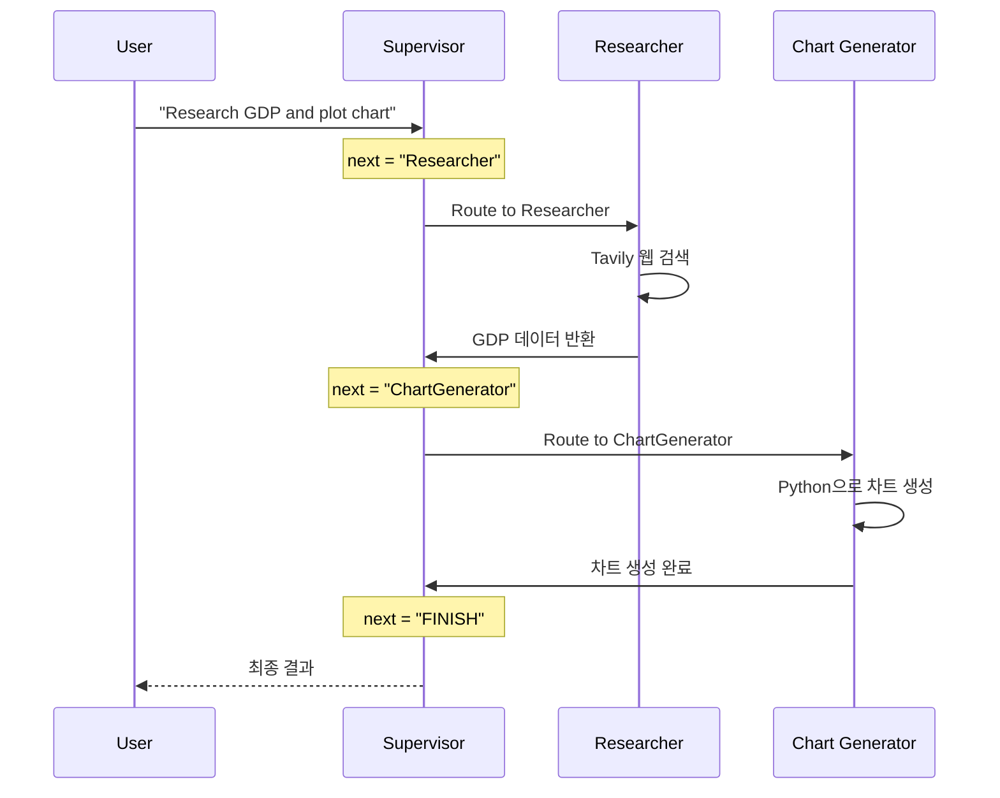

# 멀티 에이전트 슈퍼바이저 (Multi-Agent Supervisor)

**슈퍼바이저 에이전트(Supervisor Agent)**가 **연구원(Researcher, 웹 검색)**과 **차트 생성기(Chart Generator, Python 실행)** 사이에서 작업을 라우팅(분배)하는 멀티 에이전트 시스템입니다.

## LangGraph란?

LangGraph는 LangChain 팀에서 개발한 라이브러리로, **상태 기반의 순환 그래프 구조**를 통해 복잡한 AI 에이전트 시스템을 구축할 수 있게 해줍니다.

## 이 예제에서 배우는 것

- **슈퍼바이저 패턴**: 중앙 관제 역할을 하는 LLM이 여러 작업자(Worker) 에이전트를 조율하는 방법
- **멀티 에이전트 아키텍처**: 여러 전문화된 에이전트가 협업하여 복잡한 작업을 수행하는 구조
- **함수 호출 기반 라우팅**: LLM이 구조화된 출력으로 다음 에이전트를 선택
- **도구 통합**: 웹 검색(Tavily)과 Python 코드 실행 같은 다양한 도구 연동

## 아키텍처 (Architecture)

```mermaid
graph TD
    Start((Start)) --> Supervisor

    subgraph "Supervisor Agent"
        Supervisor[Supervisor Node<br/>(Gemini 2.0 Flash)]
    end

    subgraph "Worker Agents"
        Researcher[Researcher Node<br/>(Tavily Search)]
        ChartGen[Chart Generator Node<br/>(Python REPL)]
    end

    Supervisor -- "Next: Researcher" --> Researcher
    Supervisor -- "Next: ChartGenerator" --> ChartGen
    Supervisor -- "FINISH" --> End((End))

    Researcher --> Supervisor
    ChartGen --> Supervisor
```

---

## 📝 코드 상세 분석

### 파일 구조

```
multi_agent_supervisor/
├── main.py              # 실행 진입점
├── src/
│   ├── agents.py        # 에이전트 정의
│   └── graph.py         # 그래프 구성
└── requirements.txt
```

---

### 1. 상태 정의 (graph.py)

```python
import operator
from typing import Annotated, Sequence
from langchain_core.messages import BaseMessage

class AgentState(TypedDict):
    # 메시지는 누적됨 (operator.add)
    messages: Annotated[Sequence[BaseMessage], operator.add]
    # 다음에 실행할 노드
    next: str
```

**특징**: `next` 필드로 다음 에이전트를 명시적으로 지정

---

### 2. 슈퍼바이저 정의

```python
members = ["Researcher", "ChartGenerator"]
system_prompt = (
    "You are a supervisor tasked with managing a conversation between the"
    " following workers: {members}. Given the following user request,"
    " respond with the worker to act next. Each worker will perform a"
    " task and respond with their results and status. When finished,"
    " respond with FINISH."
)

options = ["FINISH"] + members  # ["FINISH", "Researcher", "ChartGenerator"]
```

---

### 3. 구조화된 출력 (함수 호출)

```python
# LLM이 반드시 next 필드를 반환하도록 강제
function_def = {
    "name": "route",
    "description": "Select the next role.",
    "parameters": {
        "title": "routeSchema",
        "type": "object",
        "properties": {
            "next": {
                "title": "Next Role",
                "type": "string",
                "enum": options,  # 제한된 선택지
            }
        },
        "required": ["next"],
    },
}

# 슈퍼바이저 체인
supervisor_chain = (
    prompt
    | llm.bind_tools(tools=[function_def], tool_choice="route")
    | parse_route  # 응답에서 next 추출
)
```

**핵심**: `tool_choice="route"`로 반드시 라우팅 함수를 호출하도록 강제

---

### 4. 작업자 노드 래퍼

```python
def agent_node(agent, name):
    """에이전트 출력을 그래프 형식으로 변환하는 래퍼"""
    def _node(state):
        result = agent.invoke(state)
        last_message = result["messages"][-1]
        # 이름을 붙여서 누가 응답했는지 표시
        return {"messages": [AIMessage(content=last_message.content, name=name)]}
    return _node

researcher_node = agent_node(researcher_agent, "Researcher")
chart_node = agent_node(chart_agent, "ChartGenerator")
```

---

### 5. 그래프 조립

```python
workflow = StateGraph(AgentState)

# 노드 추가
workflow.add_node("Supervisor", supervisor_node)
workflow.add_node("Researcher", researcher_node)
workflow.add_node("ChartGenerator", chart_node)

# 작업자 → 슈퍼바이저 (항상)
workflow.add_edge("Researcher", "Supervisor")
workflow.add_edge("ChartGenerator", "Supervisor")

# 슈퍼바이저 → 조건부 라우팅
conditional_map = {k: k for k in members}  # {"Researcher": "Researcher", ...}
conditional_map["FINISH"] = END

workflow.add_conditional_edges(
    "Supervisor", 
    lambda x: x["next"],  # next 필드 값으로 라우팅
    conditional_map
)

workflow.add_edge(START, "Supervisor")
```

---

### 6. 실행 (main.py)

```python
def main():
    graph = create_graph()
    
    user_input = "Research the GDP of South Korea over the last 5 years and plot a line chart."
    initial_state = {"messages": [HumanMessage(content=user_input)]}
    
    for step in graph.stream(initial_state):
        if "__end__" not in step:
            for key, value in step.items():
                print(f"--- Node: {key} ---")
                if "messages" in value:
                    print(value["messages"][-1].content)
                elif "next" in value:
                    print(f"Supervisor decided next: {value['next']}")
```

---

## 실행 흐름 예시



---

## 슈퍼바이저 vs 네트워크 패턴 비교

| 항목 | 슈퍼바이저 패턴 | 네트워크 패턴 |
|------|----------------|--------------|
| 제어 구조 | 중앙 집중 | 분산/탈중앙 |
| 라우팅 결정 | 슈퍼바이저 LLM | 각 에이전트가 직접 |
| 복잡도 | 단순 | 복잡 |
| 확장성 | 쉬움 (작업자 추가) | 어려움 |
| 유연성 | 낮음 | 높음 |

---

## 활용 사례

1. **데이터 분석 자동화**: 웹에서 데이터를 수집하고 자동으로 시각화
2. **리서치 보조**: 정보 검색과 결과 정리를 자동화
3. **보고서 생성**: 여러 소스에서 정보를 모아 차트와 함께 보고서 작성
4. **코드 생성 + 실행**: 코드를 생성하고 실행 결과를 확인

## 새 작업자 추가하기

```python
# 1. 새 에이전트 정의
from langchain_experimental.tools import PythonREPLTool

summarizer_tools = [...]  # 요약 도구
summarizer_agent = create_react_agent(llm, summarizer_tools)

# 2. members에 추가
members = ["Researcher", "ChartGenerator", "Summarizer"]

# 3. 노드 추가
workflow.add_node("Summarizer", agent_node(summarizer_agent, "Summarizer"))
workflow.add_edge("Summarizer", "Supervisor")
```

## 빠른 시작 (Quick Start)

### 필수 요구사항 (Prerequisites)

- Python 3.10 이상
- Google Cloud API Key (Gemini 사용을 위해 필요)
- Tavily API Key (웹 검색을 위해 필요)

### 설치 및 실행 (Setup & Run)

1.  프로젝트 폴더로 이동합니다:

    ```bash
    cd multi_agent_supervisor
    ```

2.  의존성 패키지를 설치합니다:

    ```bash
    pip install -r requirements.txt
    ```

3.  환경 변수를 설정합니다:

    ```bash
    # .env 파일 생성
    GOOGLE_API_KEY=your_google_api_key
    TAVILY_API_KEY=your_tavily_api_key
    ```

4.  애플리케이션을 실행합니다:
    ```bash
    python main.py
    ```

## 실행 예시 (Example Query)

> "Research the GDP of South Korea over the last 5 years and plot a line chart."

**예상 출력**:
```
--- Node: Supervisor ---
Supervisor decided next: Researcher

--- Node: Researcher ---
South Korea's GDP over the last 5 years:
- 2019: $1.64 trillion
- 2020: $1.63 trillion
...

--- Node: Supervisor ---
Supervisor decided next: ChartGenerator

--- Node: ChartGenerator ---
Chart saved to 'chart.png'

--- Node: Supervisor ---
Supervisor decided next: FINISH
```

---

*LangGraph 튜토리얼 프로젝트의 일부입니다.*
