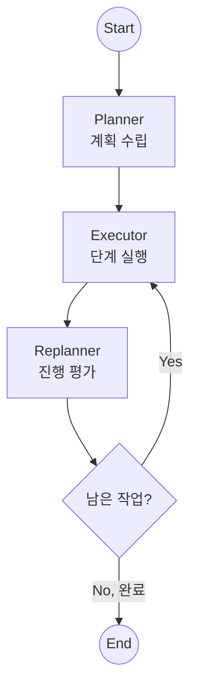
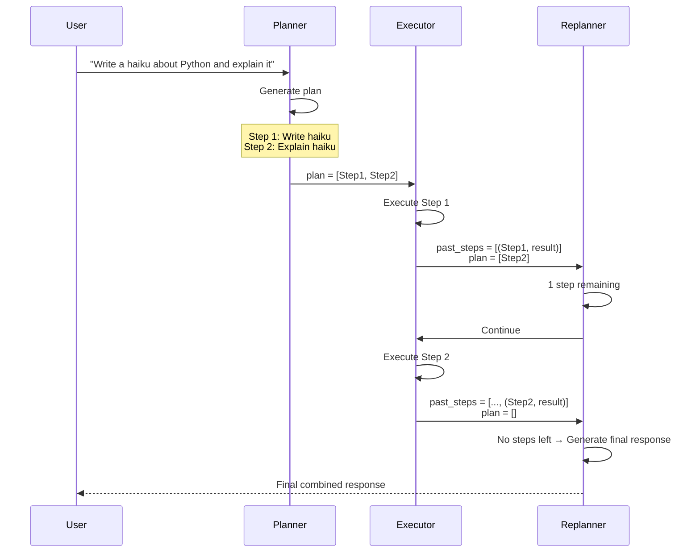

# 계획 및 실행 (Plan-and-Execute)

에이전트가 복잡한 작업을 수행할 때 **먼저 계획(Plan)을 세우고**, 순차적으로 **실행(Execute)**하는 패턴입니다. 실행 결과에 따라 계획을 수정(**Re-plan**)할 수도 있습니다.

## LangGraph란?

LangGraph는 LangChain 팀에서 개발한 라이브러리로, **상태 기반의 순환 그래프 구조**를 통해 복잡한 AI 에이전트 시스템을 구축할 수 있게 해줍니다. Plan-and-Execute는 복잡한 작업을 체계적으로 수행하는 고급 패턴입니다.

## 이 예제에서 배우는 것

- **계획 수립 (Planning)**: 복잡한 작업을 단계별로 분해
- **순차 실행 (Execution)**: 계획대로 하나씩 작업 수행
- **재계획 (Replanning)**: 실행 결과에 따라 계획 수정
- **구조화된 출력**: Pydantic으로 계획 형식 강제

## 아키텍처



---

## 📝 코드 상세 분석

### 1. 데이터 모델 정의

```python
from typing import Annotated, List
from pydantic import BaseModel, Field
import operator

class Plan(BaseModel):
    """Plan to follow."""
    steps: List[str] = Field(
        description="different steps to follow, should be in sorted order"
    )

class Response(BaseModel):
    """Response to user."""
    response: str
```

**Purpose**: LLM의 출력 형식을 강제하여 안정적인 파싱 보장

---

### 2. 상태 정의

```python
class PlanExecuteState(TypedDict):
    input: str                                    # 원본 요청
    plan: List[str]                               # 남은 계획 단계들
    past_steps: Annotated[List[tuple], operator.add]  # 완료된 (단계, 결과) 튜플
    response: str                                 # 최종 응답
```

**핵심**: `operator.add`로 `past_steps`는 누적됨

---

### 3. Planner 노드

```python
def planner(state: PlanExecuteState):
    """Generates the initial plan."""
    print("--- [Planner] Generating Plan ---")
    
    # 구조화된 출력으로 계획 생성
    planner_llm = llm.with_structured_output(Plan)
    plan = planner_llm.invoke(
        f"For the given objective, come up with a simple step by step plan.\n"
        f"Objective: {state['input']}"
    )
    return {"plan": plan.steps}
```

**예시 출력**:
```python
{
    "plan": [
        "Step 1: Write a haiku about Python",
        "Step 2: Explain the meaning of the haiku",
        "Step 3: Format the final response"
    ]
}
```

---

### 4. Executor 노드

```python
def executor(state: PlanExecuteState):
    """Executes the first step of the plan."""
    plan = state["plan"]
    step_to_execute = plan[0]  # 첫 번째 단계만 실행
    print(f"--- [Executor] Executing Step: {step_to_execute} ---")
    
    # 실제로는 도구를 호출하겠지만, 여기서는 LLM으로 시뮬레이션
    task_llm = llm
    result = task_llm.invoke(
        f"Execute this task: {step_to_execute}. Provide a concise result."
    )
    
    return {
        "past_steps": [(step_to_execute, result.content)],  # 완료된 단계 추가
        "plan": plan[1:]  # 첫 번째 단계 제거
    }
```

**핵심 로직**:
- `plan[0]`: 현재 실행할 단계
- `plan[1:]`: 남은 단계들 (현재 단계 제거)
- `past_steps`: 완료된 단계와 결과 기록

---

### 5. Replanner 노드

```python
def replanner(state: PlanExecuteState):
    """Decides whether to continue or finish."""
    
    # 남은 계획이 없으면 완료
    if not state["plan"]:
        print("--- [Replanner] Finished! Generating final response ---")
        final_response = llm.invoke(
            f"Generate a final response to the original input based on these steps: "
            f"{state['past_steps']}\nOriginal Input: {state['input']}"
        )
        return {"response": final_response.content}
    
    # 남은 단계가 있으면 계속
    print(f"--- [Replanner] {len(state['plan'])} steps remaining... ---")
    return {}  # 상태 변경 없음, 다음 실행으로
```

---

### 6. 종료 조건

```python
def should_end(state: PlanExecuteState):
    """최종 응답이 있으면 종료, 없으면 계속 실행"""
    if state.get("response"):
        return END
    return "executor"
```

---

### 7. 그래프 조립

```python
workflow = StateGraph(PlanExecuteState)

workflow.add_node("planner", planner)
workflow.add_node("executor", executor)
workflow.add_node("replanner", replanner)

workflow.add_edge(START, "planner")
workflow.add_edge("planner", "executor")
workflow.add_edge("executor", "replanner")
workflow.add_conditional_edges("replanner", should_end, ["executor", END])

app = workflow.compile()
```

---

## 실행 흐름 예시



---

## 고급 패턴: 동적 재계획

실제 프로덕션에서는 실행 결과에 따라 계획을 수정할 수 있습니다:

```python
def replanner(state: PlanExecuteState):
    # 마지막 실행 결과 분석
    last_step, last_result = state["past_steps"][-1]
    
    # 실패 감지 시 재계획
    if "error" in last_result.lower():
        new_plan = llm.invoke(
            f"The step '{last_step}' failed with: {last_result}\n"
            f"Revise the remaining plan: {state['plan']}"
        )
        return {"plan": new_plan.steps}
    
    # ... 기존 로직
```

---

## ReAct vs Plan-and-Execute 비교

| 항목 | ReAct | Plan-and-Execute |
|------|-------|------------------|
| 접근 방식 | 한 번에 한 단계씩 결정 | 먼저 전체 계획 수립 |
| 계획 | 암묵적 (LLM 내부) | 명시적 (상태에 저장) |
| 복잡한 작업 | 어려움 | 적합 |
| 재계획 | 자동 (매 단계) | 필요시 명시적 |
| 투명성 | 낮음 | 높음 (계획 확인 가능) |

---

## 활용 사례

1. **복잡한 리서치 작업**: 여러 단계의 조사와 분석이 필요한 작업
2. **프로젝트 자동화**: 여러 하위 작업으로 구성된 프로젝트 관리
3. **코드 생성**: 설계 → 구현 → 테스트 같은 순차적 개발 작업
4. **문서 생성**: 개요 → 각 섹션 작성 → 편집 → 최종화

## 빠른 시작

1.  폴더 이동:
    ```bash
    cd plan_and_execute
    ```
2.  실행:
    ```bash
    # (최초 실행 시) cp ../multi_agent_supervisor/.env .
    python main.py
    ```

## 실행 예시

```
Initializing Plan-and-Execute Agent...

--- [Planner] Generating Plan ---
--- [Executor] Executing Step: Write a haiku about Python ---
--- [Replanner] 1 steps remaining... ---
--- [Executor] Executing Step: Explain the haiku ---
--- [Replanner] Finished! Generating final response ---

[Final Response]:
Here's a haiku about Python:

    Snakes in the code dance,
    Indentation guides the flow,
    Elegant and clean.

This haiku captures Python's serpent namesake, its signature 
indentation-based syntax, and its reputation for clean, readable code.
```

---

*LangGraph 튜토리얼 프로젝트의 일부입니다.*
